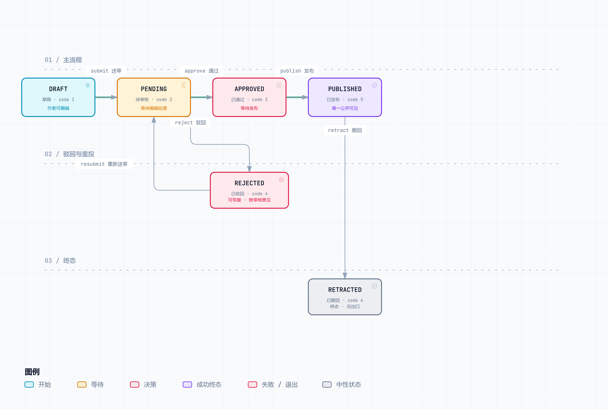
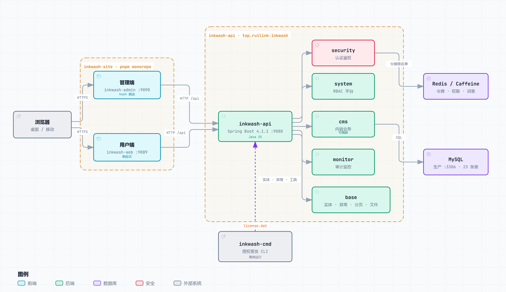
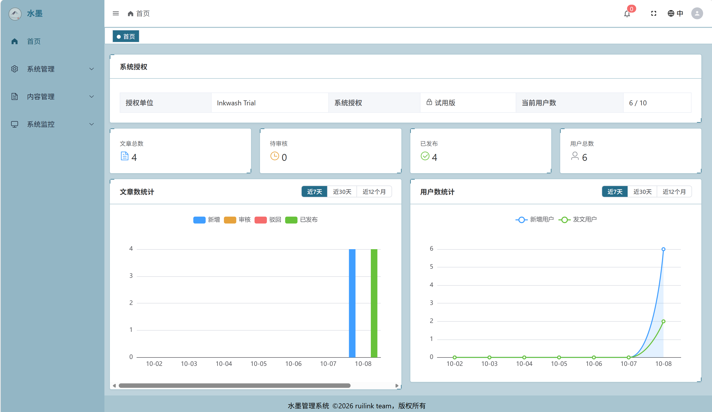
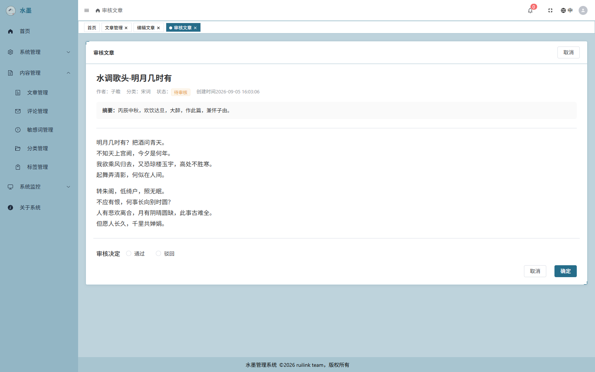
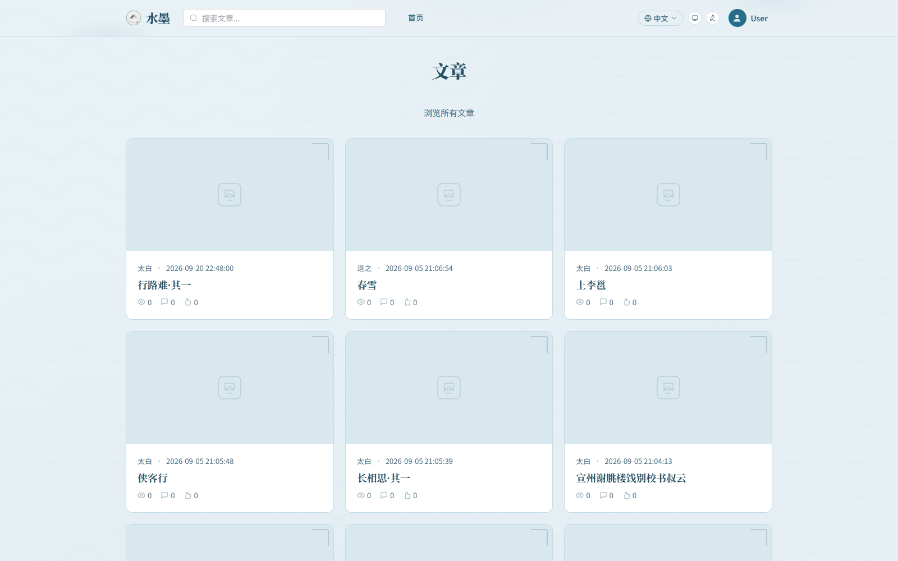
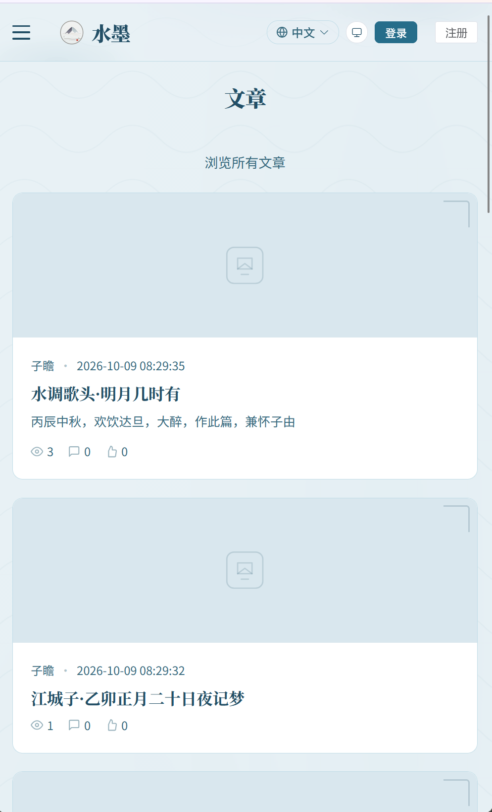

<div align="center">

# 水墨 · Inkwash

### 开箱即用、可拆可换的内容平台 —— Spring Boot 4 模块化单体 + Vue 3 双前端

[English](README.md) | 中文

[](LICENSE)
[]()
[]()
[]()
[]()
[](reference/system-design.md)
[](COMMERCIAL-LICENSE.md)
[](CONTRIBUTING.zh-CN.md)

</div>

---

## 四种登录，一个身份。

密码+验证码、扫码、短信、GitHub OAuth2 ——
每种都是指向同一个 `sys_user` 的**独立 `sys_account` 记录**。四种都绑定，想用哪个用哪个。

浏览器会话走 `HttpOnly` Cookie。**token 从不落在 `localStorage`，也不暴露给任何 JS 变量。**

这不是四个登录页，是一个身份的四条入口。下面是它背后的五个具体设计 ——
每个都解决一个真实的问题，而不是为了展示技术栈。

---

## 30 秒跑起来

默认 `dev` profile **既不需要 MySQL 也不需要 Redis** —— 内存 H2 + Caffeine，首次启动自动建表写入种子数据。

```bash
# 1 · 启动后端（Java 25 · Maven wrapper 自带）
cd inkwash-api
./mvnw spring-boot:run          # Windows: .\mvnw.cmd spring-boot:run

# 2 · 启动前端（Node ≥ 22.12 · pnpm 9）
cd ../inkwash-site
pnpm install
pnpm dev:admin                  # 管理端 → http://localhost:9090
pnpm dev:web                    # 用户端 → http://localhost:9089
# 3 · 登录
```

| 用户 | 密码 |
|---|---|
| `admin` | `Super99*` |
| `system` | `Super99*` |

→ API 在 `http://localhost:9080` · H2 控制台在 `/h2-console` · Actuator 健康检查在 `/actuator/health`

> **除笔记本之外的任何部署，请先改掉这两个密码。** 由 `database/init-data.sql` 写入，是公开的开发
> 默认口令 —— 这里公开写出是为了让快速开箱即用。

---

## 1 · 能发现盗用的刷新令牌

每次刷新都在同一个**族 ID** 下轮换令牌。重放一个已消费的刷新令牌，会撤销**整个令牌族**
并强制重新认证 —— 而不只是拒绝这一次请求。

登出时按令牌索引写入黑名单，TTL 等于该令牌的剩余有效期。令牌自然过期，黑名单条目自然消失，
不需要额外的清理任务。

令牌本身是 jjwt 签的 **HS384**，签名密钥长度在启动时校验：不得是众所周知的占位值，
且 ≥ 48 字节，否则应用起不来。

> **为什么 Cookie 而不是 `localStorage`？** `HttpOnly` 的 token 不被任何脚本读到，
> 因此一次 XSS 偷不走会话。代价是需要 CSRF 防护 —— Inkwash 用基于 Origin 的校验，
> 而不是额外的 token 往返。

---

## 2 · 一个能念出来的权限字符串

```java
@PostMapping("/articles/{id}/review")
@PreAuthorize("hasAuthority('cms:article:review')")   // module:resource:action
```

**84 条**权限种子（`system` 38 · `cms` 39 · `monitor` 7）、**4 个**角色、**一条**解析链：

```
sys_user → sys_user_group → sys_group → sys_group_role
         → sys_role → sys_role_permission → sys_permission
```

用户到角色**没有任何捷径**，必经用户组。如果某个权限无法经由用户组抵达，它对这个用户就不存在 ——
所以审计「这个人为什么能看到这篇文章」只需要读三张表，而不是解释一套解析规则。

菜单树**就是**这条链的结果。给角色加一个权限，页面就出现，前端无需重新部署。

---

## 3 · 编辑工作流是一台状态机

六个状态，每个动作只对应一条合法迁移：

| 起点 | 动作 | 终点 |
|---|---|---|
| `DRAFT(1)` | `submit` | `PENDING(2)` |
| `PENDING(2)` | `approve` | `APPROVED(3)` |
| `PENDING(2)` | `reject` | `REJECTED(4)` |
| `REJECTED(4)` | `resubmit` | `PENDING(2)` |
| `APPROVED(3)` | `publish` | `PUBLISHED(5)` |
| `PUBLISHED(5)` | `retract` | `RETRACTED(6)` |



强制执行写在**领域对象**（`cms/domain/Article.java`）里，不在 Controller 里。每个动作自行校验来源状态，
因此非法迁移是**不可达**的，而不只是被界面藏起来。

三条规则：作者只能管理自己的文章；**审核必须由另一个人**（作者审自己的稿不行）；管理员可撤回已发布内容。

每次迁移都是一次 **compare-and-set 更新** —— 两个并发审核员不可能同时成功。这不是应用层加锁，
是 SQL 层面的条件更新。

---

## 4 · 知道字段语义的 XSS 过滤

大多数过滤器只有两种模式：全转义，或全放行。Inkwash 按**字段名**分别处理：

| 字段 | 处理方式 |
|---|---|
| `content` | 当 Markdown 处理，保留格式 |
| `title` / `summary` / `keywords` | 当富文本，允许内联标记 |
| 口令、验证码、令牌 | **原样放行** —— 转义会破坏它们 |

基于 OWASP Java HTML Sanitizer。这是字段感知的，不是一刀切的转义。

用户提交的内容在前端侧再过一遍：`markdown-it` 渲染 + DOMPurify 净化。

---

## 5 · 业务层可以整个删掉

`cms`（文章、评论、分类、标签、互动、审核）与平台层（`base` / `security` / `system` / `monitor`）
之间只有**单向依赖**。把整个 `cms` 目录删掉，剩下的四个包照样 `./mvnw clean package` 通过。

| 你想要…… | 就用…… |
|---|---|
| **今天就上线**一个内容平台 | 整套直接跑 —— `cms` 已实现文章、工作流、评论和分类标签 |
| 在**成熟底座**上做自己的产品 | 只留四个平台包。它们完全不知道文章为何物，模块你自己写 |

`cms` 是一个**业务模块的参考实现**。读它、抄它、或者整个删掉都行。



四个测试会在你越界时变红 —— [`BaseLayerBoundaryTest`](inkwash-api/src/test/java/top/ruilink/inkwash/base/domain/BaseLayerBoundaryTest.java)
拦 `base → security` 的 import，[`PackageLayoutTest`](inkwash-api/src/test/java/top/ruilink/inkwash/base/PackageLayoutTest.java)
守包职责分离，[`ComponentWiringTest`](inkwash-api/src/test/java/top/ruilink/inkwash/base/ComponentWiringTest.java)
拦「能编译、运行时炸」的包迁移，[`SchemaParityTest`](inkwash-api/src/test/java/top/ruilink/inkwash/base/SchemaParityTest.java)
防 H2 与 MySQL 的 schema 漂移。

---

## 界面

**管理端** —— 导航由服务端驱动。多标签页、`keep-alive`、两套可切换布局，五套主题
（`ink-dark` 是真正的暗色模式，不是把亮色反相）。



<div align="center"><sub>仪表盘 —— 首页按角色差异化：编辑看到待审核数，管理员看到用户总数</sub></div>



<div align="center"><sub>审核 —— 通过 / 驳回并附审核意见，左右对照</sub></div>

**用户端** —— 阅读无需登录，响应式兼容到 360px。



<div align="center"><sub>用户端 —— 登录后评论、点赞、收藏、分享</sub></div>



<div align="center"><sub>移动端 360px</sub></div>

> **短信是已接线的扩展点，不是可用通道。** `POST /api/auth/sms/code` 会校验验证码、生成 6 位码并存下来，
> 但**没有接入任何短信服务商**，消息不会真实下发。登录页保留该页签但置灰标注「暂不可用」——
> 让缺口可见，而不是静默失效。

---

## 技术栈

**后端** —— Java 25 · Spring Boot 4.1.1 · MyBatis 4.1.0 注解驱动 SQL · Jackson 3 ·
jjwt 0.13.0（HS384）· H2（开发）/ MySQL（生产）· Caffeine / Redis · hutool-captcha · ZXing ·
OWASP Java HTML Sanitizer · AspectJ · JUnit 5 + Mockito + GreenMail

**前端** —— Vue 3.5 · Vite 8 · Element Plus 2.14 · Tailwind CSS 4 · Pinia 4 · Vue Router 5 ·
vue-i18n 11 · ECharts 6 · markdown-it 14 · md-editor-v3 6 · cropperjs · axios + axios-retry ·
Vitest 4 · Playwright · oxlint + oxfmt

**CLI** —— Java 25 · Picocli 4.7.7 · Jackson 3 · Jansi

**测试规模** —— 后端 98 个测试源文件 · 前端 24 个 spec 文件 · CLI 31 个用例。
H2 是一等开发目标，**跑测试不需要 Docker**。

---

## 功能导览

| 包 | 职责 |
|---|---|
| **base** | 基础实体、RFC 7807 错误处理、缓存抽象、i18n、带路径穿越防护的文件存储 |
| **security** | JWT、令牌轮换 + 重放检测、`HttpOnly` Cookie 会话、Origin CSRF、字段感知 XSS、4 种登录策略 |
| **system** | `user`、`account`、`identity`、`group`、`role`、`permission`、`menu`、`notice`、`preference` |
| **monitor** | 登录日志、AOP 操作审计、Hikari + JMX 指标、健康探针 |
| **cms** | 文章、分类、标签、评论、互动、敏感词、工作流、仪表盘统计 —— **可插拔** |

**管理端** —— 两套布局 · 多标签页 + `keep-alive` · 文章（列表/编辑/审核/发布）· 用户、用户组、角色、
权限、菜单、公告 · 登录日志、操作日志、实时 Actuator 指标 · 五套主题

**用户端** —— 公开浏览 · `markdown-it` + DOMPurify · 评论/点赞/收藏/分享 · 「我的空间」四类列表 ·
768px 以下折叠式导航

---

## 配置

| 变量 | 是否必需 | 用途 |
|---|:---:|---|
| `AUTH_JWT_SECRET` | **生产必填** | HS384 签名密钥。≥ 48 字节且不是占位值，否则启动失败 |
| `MYSQL_PASSWORD` | **生产必填** | 生产数据源 |
| `REDIS_PASSWORD` | **生产必填** | 生产缓存 |
| `LICENSE_PUBLIC_KEY` | 可选 | 校验 `license.dat` 的 RSA 公钥 |
| `OAUTH2_GITHUB_CLIENT_ID` / `_SECRET` | 可选 | 启用 GitHub 登录页签 |
| `VITE_API_URL` | 可选 | 前端 API 基址 |

> **切勿提交凭据。** 根目录 `.gitignore` 已排除 `*.pem` 与 `license.dat`。

需要更高用户数上限时，为你的主机申请授权：

```bash
cd inkwash-cmd && mvn clean package -DskipTests
java -jar target/inkwash-cmd-0.5.1.jar machine-code    # 本机 32 位十六进制指纹
```

把该指纹发到 **dyllons@163.com**，你会收到一份签名后的 `license.dat`。
把它放到 API 的外部配置路径下并重启。应用**无需授权即可运行**。

---

## 仓库结构

```
inkwash/
├── inkwash-api/          Spring Boot 后端 · base/ security/ system/ monitor/ cms/
├── inkwash-cmd/          授权 CLI（picocli）
├── inkwash-site/         pnpm monorepo · share/ admin/ web/
├── reference/
│   ├── system-design.md  规范性设计文档（1901 行 · 含 D1–D12 改动代价清单）
│   ├── diagrams/         设计图的静态导出
│   └── images/           产品截图
└── LICENSE               GPL-3.0
```


各子项目 README：[inkwash-api](inkwash-api/README.zh-CN.md) ·
[inkwash-cmd](inkwash-cmd/README.zh-CN.md) · [inkwash-site](inkwash-site/README.zh-CN.md)

---

## 参与贡献

请先阅读 **[CONTRIBUTING.zh-CN.md](CONTRIBUTING.zh-CN.md)** —— [English](CONTRIBUTING.md) ——
含各子项目已验证的命令、代码风格规则、不可随手破坏的 D1–D12 设计约束、授权条款。

```bash
cd inkwash-api && ./mvnw test            # 后端
cd inkwash-cmd && mvn test               # CLI
cd inkwash-site && pnpm lint             # 前端
cd inkwash-site && pnpm test:unit --run  # 前端测试
```

Java 用 **TAB** 缩进，JS/Vue 用 2 空格。`pnpm test:unit` 需要 `--run`，否则进 watch 模式。

---

## 支持本项目

如果您觉得这个项目对您有帮助，欢迎通过以下方式支持我。您的支持将帮助我投入更多时间进行维护和新功能开发。

> **下方收款码仅用于接受捐赠。** 它**不是**购买授权、付费档或任何商业权益的途径。
> 捐赠不授予任何权利。商业条款见[授权文档](COMMERCIAL-LICENSE.md)，除此之外一概不提供。

<details>
<summary>🇨🇳 支付宝 / 微信</summary>
<br>

| 支付宝 | 微信 |
|:---:|:---:|
|  |  |

</details>


或者点个 ⭐️ Star 支持一下，您的每一个 Star 也是我持续更新的动力！🚀

---

## 许可证

Inkwash 采用 **GNU General Public License v3.0** 协议 —— 完整文本见 [`LICENSE`](LICENSE)。

如果您希望免除 GPL-3.0 中的 copyleft 义务，Inkwash 则提供了
[COMMERCIAL LICENSE](COMMERCIAL-LICENSE.md) 协议，授权事宜请联系 `dyllons@163.com`。

直接以 GPL-3.0 使用 Inkwash —— **包括商业用途** —— 无需申请任何许可。

| 你想要…… | 就用…… | 你需要承担的义务 |
|---|---|---|
| 使用、修改、部署 Inkwash，**包括商业用途** | **GPL-3.0** | 你自己的修改须按 GPL-3.0 发布。无用户数上限、无功能限制、无需申请许可 |
| 免除「必须公开自己修改」的 copyleft 义务 | [商业授权](COMMERCIAL-LICENSE.md) | 无 copyleft 义务。授权范围以签署文件为准 |

> **无担保。** 无论走哪条路径，**都不包含任何软件担保** —— GPL-3.0 第 15–16 条
> （免责与责任限制）继续适用。商业授权同样不隐含担保，它是一份使用许可，
> 不是可用性或适用性的承诺。详见 [`COMMERCIAL-LICENSE.md`](COMMERCIAL-LICENSE.md) 的免责声明。

商业授权随附的 `license.dat` 是**一份权益记录，不是 DRM**。校验发生在你自己的进程里，
用的是随源码分发的公钥。任何人都能读懂那段校验代码，我们不声称能防破解。

---

## 致谢

[Spring Boot](https://spring.io/projects/spring-boot) · [Spring Security](https://spring.io/projects/spring-security) ·
[MyBatis](https://mybatis.org/mybatis-3/) · [Element Plus](https://element-plus.org/) ·
[Tailwind CSS](https://tailwindcss.com/) · [Pinia](https://pinia.vuejs.org/) ·
[Vue Router](https://router.vuejs.org/) · [ECharts](https://echarts.apache.org/) ·
[md-editor-v3](https://github.com/VueDevTools/md-editor-v3) ·
[OWASP Java HTML Sanitizer](https://github.com/OWASP/java-html-sanitizer) ·
[ZXing](https://github.com/zxing/zxing) · [JJWT](https://github.com/jwtk/jjwt) ·
[Caffeine](https://github.com/ben-manes/caffeine) · [JUnit 5](https://junit.org/junit5/)
