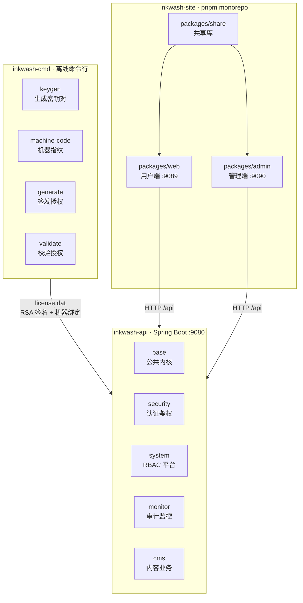
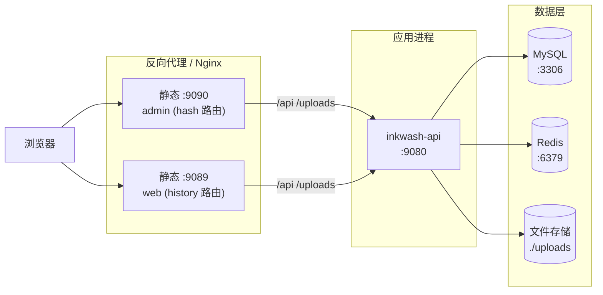
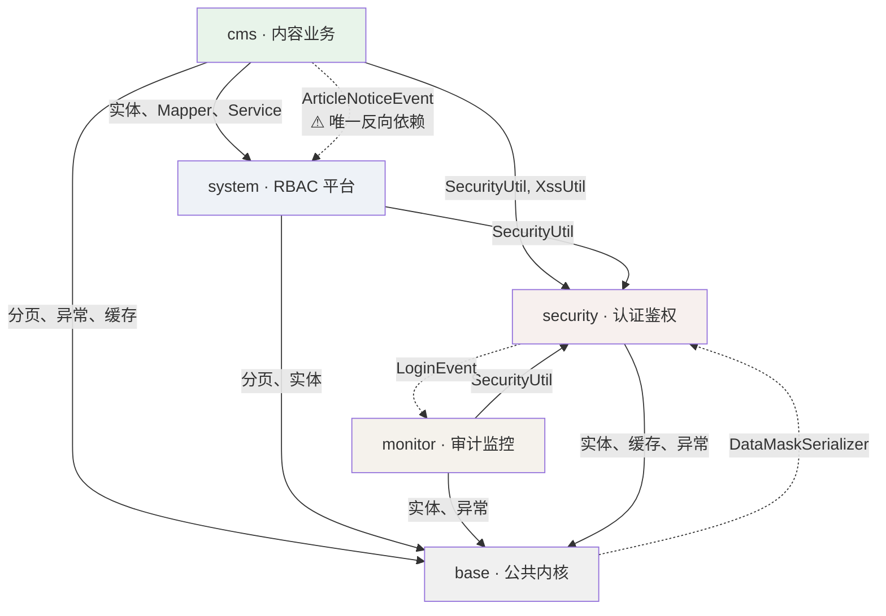
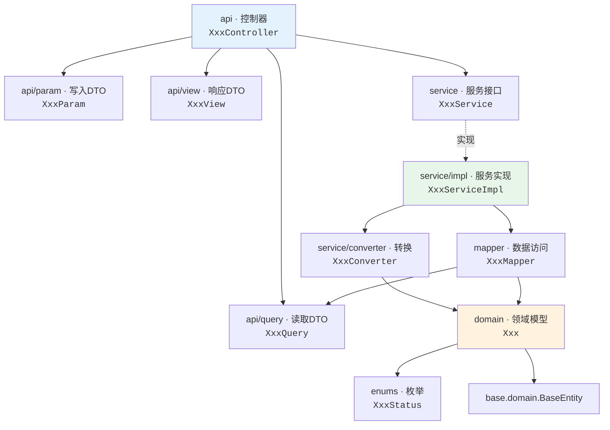
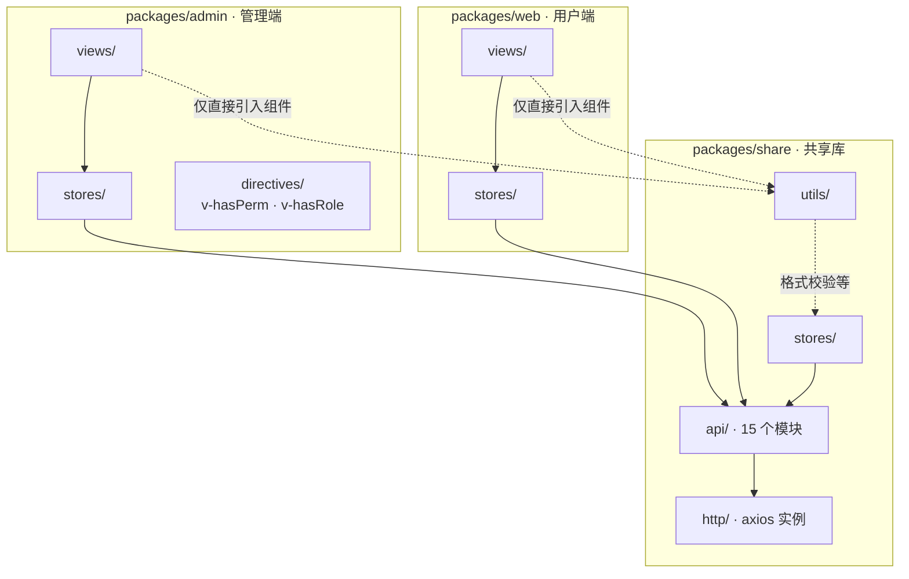
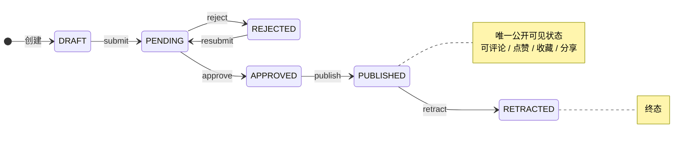
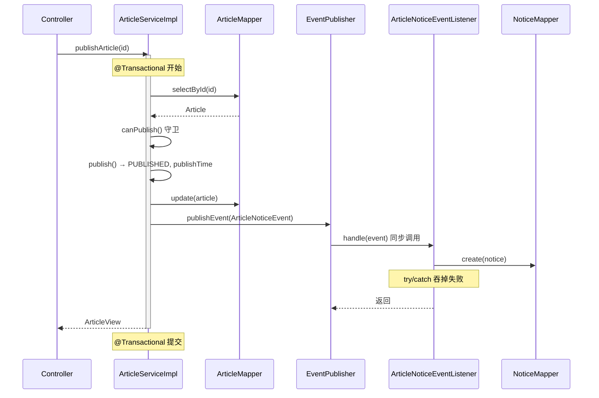
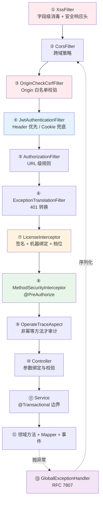
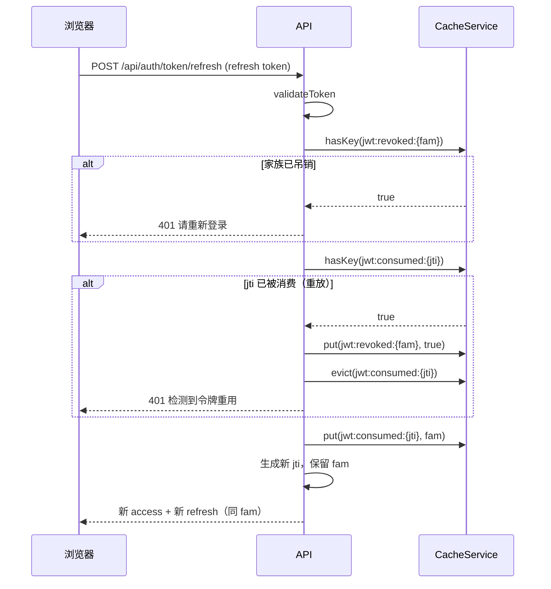

# 水墨管理系统 · 系统设计文档

> 代码基线：`0.5.1`（`top.ruilink:inkwash` / `@inkwash/share` / `inkwash-admin` / `inkwash-web`）

## 0. 关于本文档

本文档描述 Inkwash 的**设计意图**：架构如何划分、每一层应当承担什么职责、模块之间允许怎样依赖、
以及文章状态机如何运转。它是一份**规范性（normative）文档**——陈述的是系统「应当如何」。

代码实现与本文档之间的偏差不在此处记录，统一收敛到 **`ISSUES.md`（内部文档）**。
换句话说：本文档是判断实现是否正确的**依据**，而不是对当前代码的逐行测绘。

**引用约定**：文中形如 `cms/service/impl/ArticleServiceImpl.java:175` 的引用表示
「相对 `inkwash-api/src/main/java/top/ruilink/inkwash/` 的路径 + 行号」；前端路径相对
`inkwash-site/packages/`。行号对应 `0.5.1` 基线，重构后可能漂移，此时以文件名与方法名定位。

---

## 目录

1. [系统总体架构](#1-系统总体架构)
2. [模块与分层结构](#2-模块与分层结构)
3. [Article 状态管理](#3-article-状态管理)
4. [请求生命周期](#4-请求生命周期)
5. [安全架构](#5-安全架构)
6. [跨切面关注点](#6-跨切面关注点)
7. [数据模型](#7-数据模型)
8. [License 门禁](#8-license-门禁)
9. [前端架构](#9-前端架构)
10. [设计约束清单](#10-设计约束清单)

---

## 1. 系统总体架构

### 1.1 系统定位

Inkwash 是一个**模块化单体（modular monolith）**，同时提供一套可直接使用的内容管理实现。
它有两种消费方式：

| 消费方式 | 使用的包 | 适用场景 |
|---|---|---|
| **整包使用** | `base` + `security` + `system` + `monitor` + `cms` | 开箱即用的内容管理平台 |
| **底座使用** | `base` + `security` + `system` + `monitor` | 自行实现业务模块的快速开发平台 |

第二种方式是设计的核心目标：**平台层四个包不得包含任何业务领域概念**。
`cms` 是随仓库提供的参考实现，与平台层并列而非嵌入其中。

整个系统由三个独立的工程组成，各自独立构建与发布：



三个工程的职责边界：

| 工程 | 职责 | 构建产物 |
|---|---|---|
| `inkwash-api` | 全部服务端逻辑、数据库结构、授权门禁 | `inkwash-0.5.1.jar`（可执行 fat jar） |
| `inkwash-cmd` | 授权签发与校验，**不参与运行时** | `inkwash-cmd-0.5.1.jar`（可执行 CLI） |
| `inkwash-site` | 两个前端应用 + 一个共享库 | `packages/*/dist`（静态资源） |

`inkwash-cmd` 与 `inkwash-api` 之间**没有任何编译期依赖**，它们的一致性由两处约定保证：
`HardwareFingerprinter` 与 `LicenseValidator` 在两侧各有一份**逐字节相同的实现**，
且校验算法（SHA256withRSA over Base64 envelope）由 `inkwash-cmd/README.md` 规范固定。

### 1.2 技术选型

| 层 | 选型 | 版本 | 关键约束 |
|---|---|---|---|
| 语言 | Java | 25 | 记录类型、模式匹配 |
| 框架 | Spring Boot | 4.1.1 | WebMVC（非 WebFlux） |
| 持久化 | MyBatis | 4.1.0 | **手写注解 SQL，不使用 MyBatis-Plus** |
| 序列化 | Jackson | 3.x（`tools.jackson`） | 注意包名已变 |
| 数据库 | MySQL 8+ / H2（`MODE=MySQL`） | — | H2 为一等公民，非一次性替代品 |
| 缓存 | Redis（生产）/ Caffeine（开发） | — | 由 `cache.type` 切换 |
| 令牌 | jjwt | 0.13.0 | **算法锁定 HS384**，密钥 ≥ 48 字节 |
| 测试 | JUnit 5 + Mockito + GreenMail | — | 不依赖 Testcontainers / Docker |

前端：

| 层 | 选型 | 版本 |
|---|---|---|
| 框架 | Vue | 3.5（Composition API，`<script setup>`） |
| 构建 | Vite + Rolldown | 8.x |
| 组件库 | Element Plus | 2.14 |
| 原子化 CSS | Tailwind CSS | 4.x |
| 状态 | Pinia | 4.x |
| 路由 | Vue Router | 5.x |
| 图表 | ECharts + vue-echarts | 6.x（仅管理端） |
| Markdown | markdown-it + DOMPurify / md-editor-v3 | 14.x / 6.x |
| 包管理 | pnpm workspace | 9（Node ≥ 22.12） |

### 1.3 部署拓扑



三个默认端口均为**开发默认值**：

| 端口 | 归属 | 生产部署方式 |
|---|---|---|
| `9080` | `inkwash-api` | 反向代理 `/api` 与 `/uploads` 至该端口 |
| `9090` | `inkwash-admin` | 静态托管 `packages/admin/dist` |
| `9089` | `inkwash-web` | 静态托管 `packages/web/dist`，**需 history 回退** |

管理端使用 hash 路由（`/#/home`），用户端使用 HTML5 history 路由，
因此**只有用户端**需要 `try_files $uri $uri/ /index.html` 回退。
扫码登录使用 SSE（`/api/auth/qr/sse`），反向代理需关闭 `proxy_buffering` 并放宽 `proxy_read_timeout`。

### 1.4 配置与环境

后端配置按 profile 组织于 `inkwash-api/src/main/resources/`：

| 文件 | 作用 |
|---|---|
| `application.yaml` | 全 profile 共享：端口、JWT、Cookie、CORS、MyBatis、上传 |
| `application-dev.yaml` | H2 内存库、Caffeine、调试日志、H2 控制台 |
| `application-prod.yaml` | MySQL、Redis、安全收敛的日志与健康检查可见性 |

环境变量用于注入敏感值，避免落入版本库：

| 变量 | 用途 |
|---|---|
| `AUTH_JWT_SECRET` | HS384 签名密钥 |
| `LICENSE_PUBLIC_KEY` | 授权验签公钥（信任锚） |
| `MYSQL_PASSWORD` / `REDIS_PASSWORD` | 数据层凭据 |
| `OAUTH2_GITHUB_CLIENT_ID` / `OAUTH2_GITHUB_CLIENT_SECRET` | GitHub 登录 |

前端**不使用 `.env` 文件**，仅读取 `VITE_API_URL`（默认 `/api`，由开发代理转发至 `9080`）。
应用标题取自后端 `GET /api/system/meta`，OAuth2 入口为相对路径 `/oauth2/authorization/{provider}`，
因此新增登录方式不需要改动前端配置。

---

## 2. 模块与分层结构

### 2.1 五个包的职责边界

服务端是**单 Maven 构件**，根包 `top.ruilink.inkwash`，下设五个平级业务包。

| 包 | 定位 | 职责 | 是否允许依赖 `cms` |
|---|---|---|---|
| `base` | 公共内核 | 基础实体、分页与统计载体、枚举基类、异常体系、全局异常处理、缓存抽象、文件存储、i18n、工具类 | 是（平台层不得依赖） |
| `security` | 认证与安全 | JWT 签发与校验、令牌轮换、Cookie 会话、CSRF 源校验、XSS 过滤、四种登录策略、授权验签、资料与偏好 | **否** |
| `system` | RBAC 平台 | 用户、账号、身份、用户组、角色、权限、菜单、通知、偏好 | **否** |
| `monitor` | 审计与监控 | 登录日志、操作审计切面、指标采集、健康探针、缓存视图 | **否** |
| `cms` | 内容业务（参考实现） | 文章、分类、标签、评论、互动、敏感词、编辑工作流、统计看板 | — |

**设计约束**：前四个包合称**平台层**，必须保持领域中立。它们不认识「文章」「评论」这类概念，
因此可以被任何业务模块复用。`cms` 是与平台层并列的业务模块，不是平台层的一部分。

**包内单一职责（ISS-060）**：`handler` 这一名称只保留给 **MyBatis `TypeHandler`**。
其余三种角色各有专属包，不得混入 `handler`：

| 角色 | 位置 | 说明 |
|---|---|---|
| MyBatis `TypeHandler` | `base/handler`、`system/handler` | 仅此二者由 `mybatis.type-handlers-package` 扫描 |
| Spring `Converter`（`String` → 枚举） | `base/convert`、`system/convert`、`cms/convert` | 参与请求参数绑定，与持久化无关 |
| `@RestControllerAdvice` | `base/advice` | 唯一的统一异常出口 |

这条约束的直接原因：`type-handlers-package` 是**包级扫描**，MyBatis 会尝试把该包下
每个类都当作 `TypeHandler` 候选。把 Web 层 advice 与 Spring `Converter` 放进同一包，
等于让持久层配置引用一个混杂职责的命名空间。



图中两条虚线为**已知的架构欠账**，记录于 `ISSUES.md`（内部文档）。
设计的收敛方向是消除这两条边：`ArticleNoticeEvent.statusCode` 已经是 `int` 而非 `ArticleStatus`，
把监听器改为按整型分派即可解除 `system → cms` 的编译期耦合；`DataMaskSerializer` 的自视图判定
应下沉为不依赖 `SecurityUtil` 的实现。

### 2.2 标准分层模板

每个业务包采用同一套七层结构。**命名是强约定**，新增模块照此办理：



**依赖方向是单向的**：`api → service → converter → mapper → domain`，`domain` 不依赖任何上层。
`mapper` 额外依赖 `api/query`——这是一个**有意的取舍**：MyBatis 的 `<if test='query.xxx'>`
直接绑定 HTTP 查询对象，避免为每个筛选条件手写参数列表。其代价是持久层与传输层耦合，
查询对象不可迁移（记录于 `ISSUES.md`（内部文档））。

各层职责与输入输出契约：

| 层 | 职责 | 输入 | 输出 | 禁止 |
|---|---|---|---|---|
| `api` | 路由、参数绑定、校验、方法级鉴权注解 | HTTP 请求 | `ResponseEntity<T>` | 访问 `mapper`；返回 `domain` 实体 |
| `api/param` | 写入载荷，承载 Bean Validation 分组 | JSON body | — | 承载业务逻辑 |
| `api/query` | 读取筛选条件，继承 `PageQuery` | query string | — | 承载业务逻辑 |
| `api/view` | 响应投影，可按 `@JsonView` 分级暴露 | — | JSON | 承载业务逻辑 |
| `service` | 业务编排、事务边界、事件发布 | DTO / 基本类型 | DTO / `void` | 暴露 `mapper` 给控制器 |
| `service/impl` | 守卫校验、跨聚合协调、缓存与事件 | DTO | DTO | 直接返回实体给控制器 |
| `service/converter` | `domain ↔ param/view` 双向映射 | 实体 + DTO | 实体或 DTO | 访问数据库 |
| `mapper` | 手写 SQL，返回 `domain` 或统计投影 | `query` + 基本类型 | 实体 / `StatisticEntry` | 依赖 `api/view`、`api/param`、`service` |
| `domain` | 状态与不变量，自带状态机守卫 | — | 自身状态 | 依赖 `api`、`service`、`mapper` |

### 2.3 四类数据对象

系统中流通四种数据对象，各有明确边界：

| 类别 | 位置 | 命名 | 生命周期 | 例子 |
|---|---|---|---|---|
| **写入 DTO** | `api/param` | `XxxParam` | 请求生命周期内 | `ArticleParam` |
| **读取 DTO** | `api/query` | `XxxQuery extends PageQuery` | 请求生命周期内 | `ArticleQuery` |
| **响应 DTO** | `api/view` | `XxxView` | 响应序列化前 | `ArticleView` |
| **领域模型** | `domain` | `Xxx` | 与数据库行同寿命 | `Article` |

**转换是转换层的唯一职责**。`service/converter/XxxConverter` 是 `final` 类 + 私有构造 + 全静态方法，
不注册为 Spring Bean。转换遵循三条约定：

1. **入参为 null 返回 null**，不抛异常——便于链式安全调用。
2. **部分更新（partial update）独立成方法**：`updateEntity(entity, param)` 内部逐字段判空，
   只覆盖非 null 字段，实现 PATCH 语义。
3. **字段清单显式逐项拷贝**。不使用 MapStruct，因此新增实体字段不会被自动覆盖——
   转换方法是唯一需要同步修改的地方。

命名上 `system` 使用 `toUserView` / `toUserDetailView` / `toUserEntity` / `updateUserEntity`，
`cms` 的单类型转换器使用 `toView` / `toEntity` / `updateEntity`。同一语义允许两种写法，
新增转换器时**跟随所在包的既有风格**。

### 2.4 响应投影：`ResultView` 不是响应包装

`base/domain/ResultView.java` 定义三个 Jackson `@JsonView` 标记接口，构成**继承式字段投影**：

```
Basic  ←  Detail  ←  Full
```

激活 `Full` 时，`Basic` 与 `Detail` 标注的字段一并序列化。典型用途是列表接口只输出
`Basic` 字段（`id`、`title`、`status`、`publishTime`），详情接口额外输出 `Detail`
（`content`、`summary`、`coverUrl`、`tally`、分类与标签），`Full` 再补上审核意见等内部字段。

```java
public class ResultView {
    public interface Basic  { }
    public interface Detail extends Basic  { }
    public interface Full   extends Detail { }
}
```

**控制器不使用统一响应包装**。成功与否由 HTTP 状态码表达，负载即业务 DTO：

| 场景 | 返回类型 | 状态码 |
|---|---|---|
| 单对象 | `ResponseEntity<XxxView>` | 200 |
| 分页 | `ResponseEntity<PageResult<XxxView>>` | 200 |
| 列表 | `ResponseEntity<List<XxxView>>` | 200 |
| 动作类操作 | `ResponseEntity<Void>` / `ResponseEntity<XxxView>` | 200 |
| 创建 | `ResponseEntity<XxxView>` | 200 |
| 删除 | `ResponseEntity<Void>` | 204 |

`PageResult` 的 JSON 契约是字段名本身：

```json
{ "list": [], "total": 137, "pageNum": 1, "pageSize": 20, "totalPages": 7,
  "hasNext": true, "hasPrevious": false }
```

`pageNum` 为 **1 基**，而 Spring Data `Pageable` 为 0 基，`base/util/PageUtil.java` 是唯一桥接点。

**投影必须显式声明**。`@JsonView` 的激活方式是**在控制器方法上标注**——Spring MVC 在
`AbstractMessageConverterMethodProcessor` 中读取它，**不存在需要调用的 `activate()` 方法**。
未标注时 Jackson 的 `DEFAULT_VIEW_INCLUSION` 默认为 `true`，此时**所有字段都会输出**，
`Basic` / `Detail` / `Full` 的分级形同虚设。因此**返回分级视图的端点必须显式标注视图**。

> **排查投影泄漏时不要去找 `activate()` 调用**——它不存在。正确做法是逐个控制器检查
> 方法级 `@JsonView`：该机制本身正确，唯一的失败模式是「部分控制器漏标」，
> 而漏标在响应里表现为本应属于 `Detail` / `Full` 的字段出现在列表接口中。
> 返回分级视图的端点必须逐一显式标注，这一约束由 `ResultViewProjectionTest` 锁定。

当前各级别的使用情况：

| 视图 | 是否声明 `Full` 字段 | 端点采用的级别 |
|---|---|---|
| `GroupView`、`RoleView` | 否 | 详情 `Detail`，其余 `Basic` |
| `UserView`、`MenuView`/`MenuTreeView`、`PermissionView` | 否 | 全部 `Detail`（字段集与不分级时相同） |
| `ArticleView` | **是**（`opinion`、`reviewerId`） | 公开列表 `Detail`；其余 `Full` |

**不得对未声明字段分级的视图激活视图**：该视图的字段全部会被过滤掉，响应变成 `{}`。
`ResetPasswordView` 属于此类，因此 `UserController#resetPassword` **不**标注 `@JsonView`。

**共享端点的取舍**：`GET /api/cms/articles/{id}` 同时服务公开门户与管理端编辑器
（`ArticleEditor.vue` / `review.vue` / `publish.vue` 都经它取文章并渲染 `opinion`），
因此**必须保持 `Full`**。把它收窄为 `Detail` 会让编辑器静默失去驳回原因——
这正是「不做端点拆分就无法收窄」的真实代价。要真正收窄，必须先拆分公开与管理的详情端点。

上述规则由 `base/domain/ResultViewProjectionTest` 锁定（关键端点必须激活、视图级别正确、
分级视图字段必须全部标注、不得对未分级视图激活）。

### 2.5 分页约定

分页能力由 `base/domain/PageQuery` 提供：

| 字段 | 类型 | 约束 | 默认 |
|---|---|---|---|
| `page` | `Integer` | `@Min(1)` | 1 |
| `size` | `Integer` | `@Min(1) @Max(100)` | 10 |
| `sortField` | `String` | 白名单校验 | 无 |
| `sortOrder` | `String` | 白名单校验 | 无 |

**划分标准（D-14）**：按**端点是否需要多维筛选**决定用哪一套，而不是按是否公开。

| 端点形态 | 分页方式 | 理由 |
|---|---|---|
| 需要关键词 / 状态 / 时间区间 / 排序等筛选 | 定义 `XxxQuery extends PageQuery`，用 `@Valid` 绑定 | 筛选条件需要承载、校验与白名单排序，`PageQuery` 的字段才有意义 |
| 只接受 `page` 与 `size`，无任何筛选 | 直接用 `@RequestParam` | 套一层 `XxxQuery` 会得到一个字段全为空的壳类 |

因此系统中同时存在两种写法，**这不是待收敛的技术债**：

- 14 个管理端列表用 `XxxQuery`（`UserQuery`、`ArticleQuery`、`RoleQuery` 等，默认 `size = 10`）；
- `ArticleController` 的 6 处用裸 `page`/`size`，默认 `size = 20`，其中包括公开门户
  `GET /api/cms/articles` 和 5 处 `/articles/user/*`（当前用户自己的文章、收藏、点赞、
  点踩、评论列表）。这 6 处没有任何筛选字段——「我的收藏」只能查当前用户的收藏，
  不存在 `status` 或 `keyword` 的语义——因此按上表属于第二类。

注意这 6 处虽然除公开门户外都带 `@PreAuthorize("hasAuthority('cms:article:query')")`，
但**鉴权与分页形态无关**：判定依据是筛选维度，不是公开性。新增端点时按此表对照，
不要因为「需要登录」就套 `XxxQuery`，也不要因「不需要登录」就用裸参数。

页大小的限制是双重的：`@Max(100)` 与 `SortValidator`。

`ORDER BY` 采用**字符串插值**（`${sortSql}`），由 `base/util/SortValidator.java` 白名单守护：
它把驼峰字段名映射为蛇形列名，校验拼装结果匹配
`^[a-zA-Z_][a-zA-Z0-9_]* (ASC|DESC)(, …)*$`，**非白名单字段直接抛 400**，
而不是静默替换为默认值。排序字段通过 Mapper 的 `sortSql` 参数传入，不与用户输入直接拼接。

### 2.6 控制器约定

| 约定 | 规范 |
|---|---|
| 鉴权注解 | 方法级 `@PreAuthorize("hasAuthority('module:resource:action')")`；**不放在类上** |
| 公开接口 | 不加 `@PreAuthorize`，由 `SecurityConfig` 的 `permitAll` 承担 |
| 参数校验 | 类上 `@Validated`；分组按 Param 形态声明（`class` 无差异时声明空 `Default`，`record` 不声明） |
| 操作审计 | 变更类控制器类上标注 `@OperateTrace(module = "…")` |
| 枚举选项 | 通过 `EnumUtil.listOptions` 暴露 `Map<Code, Name>`，或随实体以整型 code 序列化 |

**校验注解约定（D-20）**：分组**按 Param 的形态**声明，不求形式统一。

| Param 形态 | 约定 | 校验方式 |
|---|---|---|
| `class`，有创建/更新差异 | 声明 `Create` / `Update`，两者 `extends Default`；仅两者共有的约束写在 `Default` 上 | `@Validated(XxxParam.Create.class)` / `.Update.class` |
| `class`，无差异 | 声明**一个空分组** `Default` | `@Valid @RequestBody` |
| `record` / `sealed interface` | **不声明分组** | `@Valid @RequestBody` |

```java
// class 型、无创建/更新差异：声明空分组
public class CategoryParam {

    public interface Default extends jakarta.validation.groups.Default {
    }

    @NotBlank(message = "分类名称不能为空")
    private String name;
}
```

空分组的作用是让「本 Param 无差异」成为一句**显式声明**，而不是「作者忘了写分组」的
歧义状态。约束不写 `groups = Default.class`：无分组约束本就属于
`jakarta.validation.groups.Default`，而 `XxxParam.Default` 是它的子类型，因此
`@Valid` 与 `@Validated(XxxParam.Default.class)` 校验到的约束集合完全相同。
supertype 必须写全限定名，否则嵌套的 `Default` 会遮蔽同名 import。

**`record` 型不声明分组**：`security` 包的 17 个 Param（登录、注册、改密、验证码、
第三方登录等）都是 `record` 或 `sealed interface`，约束声明在 record 组件与访问器上。
这类形态本身就不存在创建/更新差异——每次提交都是同一组字段的校验——塞一个永不引用的
空接口只会增加噪音而不改变语义，因此约定为「record 不声明分组，直接 `@Valid`」。
新增 `record` 型 Param 沿用此约定；**不要**为了对齐 `class` 而把 `record` 改写为 `class`，
那会失去不可变性、简洁构造器与访问器语义，且没有任何收益。

**转换器命名约定（D-19）**：按**转换器是否只处理一种实体**决定是否带类型前缀。

| 转换器 | 命名 | 例子 |
|---|---|---|
| 只处理一种实体 | `toView` / `toEntity` / `updateEntity` | `CategoryConverter`、`GroupConverter`、`NoticeConverter`、`PermissionConverter`、`SensitiveConverter`、`TermConverter`、`JournalConverter`、`LoginInfoConverter` |
| 处理多种实体或多种视图 | `toXxxView` / `toXxxEntity` / `updateXxxEntity` | `ArticleConverter`（`ArticleView` + `CommentView`）、`MenuConverter`（`MenuView` + `MenuTreeView`）、`RoleConverter`（`RoleView` + `RoleDetailView`）、`UserConverter`（`UserView` + `UserDetailView` + `AccountView`） |

带前缀不是历史遗留，而是**短名会冲突时的必要区分**。新增转换器时先判断它是否只处理
一种实体：是则用短名，否则用前缀——不要因为「别的地方带前缀」就照抄。

`updateEntity` 承载**部分更新语义**：逐字段判空，`null` 表示「不修改该字段」。
这是手写转换器相对代码生成器的优势所在，修改时不得简化为整体覆盖。

权限串格式固定为 `module:resource:action`，由 `SysPermission.getAuthority()` 派生
（`sys_permission` 表分列存储 `module`/`resource`/`action`，复合串是派生值而非存储值）。
资源与动作的粒度细于 CRUD，例如 `assign-group`、`reset-password`、`commit`、`review`、`retract`。

**枚举以整型 code 序列化**（枚举上的 `@JsonValue getCode()`），
因此前端按数字处理状态，中文标签由前端 i18n 字典负责，后端不承担标签下发。

### 2.7 错误处理

异常体系收敛为单一继承链，便于统一映射：

```
RuntimeException
└── BusinessException          携带 HttpStatus（默认 400）
    ├── AuthException         固定 401
    ├── ConflictException     固定 409
    └── NotFoundException     固定 404
```

`base/advice/GlobalExceptionHandler.java` 以 `@RestControllerAdvice` 拦截全部异常，
统一输出 **RFC 7807 `ProblemDetail`**：

```json
{
  "type": "about:blank",
  "title": "Conflict",
  "status": 409,
  "detail": "用户名已存在",
  "instance": "/api/system/users",
  "timestamp": "2026-10-03T11:22:33.123",
  "messageKey": "error.user.username_exists"
}
```

**规则**：业务代码一律抛出 `BusinessException` 并**只传入 `messageKey`（或带参数的 key）**。
`BusinessException` 构造时调用 `LocaleUtil.getValue(messageKey, args)` 立即解析为当前请求
`Locale` 的可展示文本，并将原始 `messageKey` 存入异常实例。`GlobalExceptionHandler` 将
`detail` 写入解析后的文本、将 `messageKey` 写入响应的 `messageKey` 字段（可供前端按需
重新本地化）。不得直接在代码中抛出中文字面量：所有业务文案都来源于
`i18n/messages*.properties`，且**每个 `error.*` key 必须同时存在于
`messages.properties`（默认/英语）与 `messages_zh_CN.properties`**（ISS-018/019/D-12）。

> 注意：登录审计 `mon_login_info.message` 在失败分支直接写入 `e.getMessage()`。这意味着
> 审计日志中的文案是**按请求者的 Accept-Language 解析后的文本**（而非稳定的 key）。
> 该偏好是对人类可读性的取舍，设计文档不强制改动，但需在审计导出/聚合时知悉此特性。

**参数化消息**：支持占位符 `{0},{1},...`，传入 `Object... args`。例如
`new BusinessException("error.sort.field_invalid", sortField)`。占位符在解析时由 Spring
MessageSource 完成，空值和集合参数按 `String.valueOf` 处理。

覆盖的异常与状态码：

| 异常 | 状态码 |
|---|---|
| `NotFoundException` | 404 |
| `ConflictException` | 409 |
| `AuthException` | 401 |
| `BusinessException` | 构造时指定，默认 400 |
| `MethodArgumentNotValidException` / `ConstraintViolationException` | 400 |
| 缺少参数 / 请求方法不支持 / 媒体类型不支持 / 请求体格式错误 / 参数类型错误 | 400 / 405 / 415 / 400 / 400 |
| `AccessDeniedException` | 403 |
| `RuntimeException` / `Exception` | 500 |

**授权失败的语义约定**：越权访问他人资源属业务规则违反，用 `BusinessException` 且携带
403 语义的状态码，与 `AccessDeniedException`（鉴权层失败，403）区分开，
使前端可以区分「没权限」与「数据不允许」。

两类失败**都是 403**，靠 `messageKey` 区分：

| 场景 | 异常 | 状态码 | `messageKey` |
|---|---|---|---|
| 缺少能力（`@PreAuthorize` 不通过） | `AccessDeniedException` | 403 | `null` |
| 有能力但数据不属于本人（越权） | `BusinessException` | **403** | 具体 i18n key，如 `error.article.notOwner` |

因此对越权点有两项要求：

1. **必须显式指定 403**——`BusinessException(String)` 的默认状态码是 400，用它表示越权
   会让前端把这两种情况混为一谈。
2. **必须传入 i18n key 而不是中文原文**——`BusinessException` 的
   `messageKey` 字段是给前端做分支用的，不是给人看的提示文案。
   单参构造器 `BusinessException(String message)` 会把传入的字符串直接写进 `messageKey`，
   **不得用于越权场景**；应使用 `BusinessException(HttpStatus.FORBIDDEN, "error.xxx")`。
   全库不得存在以中文原文构造的 `BusinessException`：`messageKey` 必须始终是语言包中
   可解析的稳定键，否则前端无法用它做分支。

**403 只用于越权，不用于其他业务失败。** 以下情形仍为 400：

| 情形 | 例 | 状态码 |
|---|---|---|
| 状态守卫 | 「只有草稿状态的文章可以提交审核」 | 400 |
| 参数 / 校验失败 | `@Valid` 未通过 | 400 |
| 业务规则冲突 | 「内容包含敏感词」 | 400 |
| 资源不存在 | 「文章不存在」 | 404 |

判据是**「是否因『数据不属于你』而失败」**：是则 403，否则按各自的既有状态码。
把状态守卫一并改成 403 会让 403 失去「越权」这一单一含义，前端也就无法用它判断该提示
「你没有权限」还是「操作不被允许」。

### 2.8 前端分层

前端遵循与后端呼应的分层：



| 包 | 定位 | 关键特征 |
|---|---|---|
| `packages/share` | 无头共享库 | **唯一**的 axios 实例、15 个 API 模块、5 个 Pinia store、i18n 实例、共享组件、Vite 配置工厂 |
| `packages/admin` | 管理端 | hash 路由；**路由由后端菜单生成**；无自有 `api/` 与 `http/` |
| `packages/web` | 用户端 | HTML5 路由；静态路由表；响应式布局 |

两端**都不直接调用 `api/` 或 `http/`**，一律经由 `@inkwash/share`。
共享库不做类型定义（全栈 JavaScript），DTO 契约依靠后端 Javadoc 与前端使用约定共同维护。

---

## 3. Article 状态管理

文章状态管理是 `cms` 模块的核心，也是平台层与业务层职责划分的样板：
**状态与守卫由领域对象自己持有，服务层只负责编排**。

### 3.1 状态定义

`cms/enums/ArticleStatus.java` 定义六个状态。**状态是名词，迁移动作是动词，二者严格分开**：

| 状态常量 | code | 含义 | 语义 |
|---|---|---|---|
| `DRAFT` | 1 | 草稿 | 作者私有，可自由编辑 |
| `PENDING` | 2 | 待审核 | 已送审，等待编辑处理 |
| `REJECTED` | 4 | 已驳回 | 审核未通过，附审核意见，等待重新送审 |
| `APPROVED` | 3 | 已通过 | 审核通过，等待发布 |
| `PUBLISHED` | 5 | 已发布 | 对外可见，唯一可互动、可撤回的状态 |
| `RETRACTED` | 6 | 已撤回 | 终态，退出公开可见集合 |

上表按**流程顺序**排列，而非 code 顺序。`rejected` 沿用 code 4、`approved` 沿用 code 3，
因此本次调整**不需要任何数据迁移**。

**为什么必须把动作与状态分开**：早期实现里 `resubmit()` 的目标是 `DRAFT`，
于是「重新送审」这个动作和「草稿」这个状态纠缠在一起，产生三个后果：
作者看不出驳回后文章处于何种处境、`rejected` 状态名与 `reject` 动作名互相干扰、
以及编辑文章时需要一段「`REJECTED → DRAFT` 回落」补丁。本模型取消该回落，
`rejected` 只能通过 `resubmit` 离开。

状态在数据库中以 `TINYINT` 存储，实体字段类型为 `ArticleStatus`，
由 `base/handler/BaseEnumTypeHandler` 完成整型与枚举的映射。
序列化时输出整型 code（`@JsonValue`），反序列化接受整型（`@JsonCreator fromCode(int)`）。

### 3.2 状态机全景



合法迁移共六条，与六个迁移动作一一对应：

| 迁移动作 | 前置状态 | 迁移后状态 | 附带写入 |
|---|---|---|---|
| `submit` | `DRAFT` | `PENDING` | `updateTime` |
| `reject` | `PENDING` | `REJECTED` | `reviewerId`、`opinion`、`updateTime` |
| `resubmit` | `REJECTED` | `PENDING` | `opinion` 清空、`updateTime` |
| `approve` | `PENDING` | `APPROVED` | `reviewerId`、`updateTime` |
| `publish` | `APPROVED` | `PUBLISHED` | `publishTime`、`updateTime` |
| `retract` | `PUBLISHED` | `RETRACTED` | `updateTime` |

**审核往返**由 `submit` / `reject` / `resubmit` 三个动作构成：
`draft → pending` 送审，`pending → rejected` 驳回，`rejected → pending` 重新送审。
往返后回到的是 `pending` 而非 `draft`，因此 `resubmit` 不需要把文章退回可自由编辑的状态。

`reject` 与 `resubmit` 各自只有唯一合法来源状态，
`pending` 与 `rejected` 由此构成一对互为出口的中间态。

### 3.3 守卫位于领域对象

每个迁移动作**自带前置校验**，违反即抛 `BusinessException`。
业务规则与状态存放于同一处，服务层不重复判断：

```java
// 送审：draft 的唯一出口
public void submit() {
    if (status != ArticleStatus.DRAFT) {
        throw new BusinessException("只有草稿状态的文章可以提交审核");
    }
    this.status = ArticleStatus.PENDING;
    this.updateTime = LocalDateTime.now();
}

// 驳回：pending 的分支出口
public void reject(Long reviewerId, String opinion) {
    if (status != ArticleStatus.PENDING) {
        throw new BusinessException("只有待审核状态的文章可以驳回");
    }
    this.status = ArticleStatus.REJECTED;
    this.reviewerId = reviewerId;
    this.opinion = opinion;
    this.updateTime = LocalDateTime.now();
}

// 重新送审：rejected 的唯一出口，目标是 pending 而非 draft
public void resubmit() {
    if (status != ArticleStatus.REJECTED) {
        throw new BusinessException("仅已驳回状态的文章可以重新提交");
    }
    this.status = ArticleStatus.PENDING;
    this.opinion = null;
    this.updateTime = LocalDateTime.now();
}

public void publish() {
    if (status != ArticleStatus.APPROVED) {
        throw new BusinessException("只有已通过审核的文章可以发布");
    }
    this.status = ArticleStatus.PUBLISHED;
    this.publishTime = LocalDateTime.now();
    this.updateTime = LocalDateTime.now();
}
```

可见性判定同样是领域方法：

```java
public boolean canView()  { return status == ArticleStatus.PUBLISHED; }
public boolean canReply() { return status == ArticleStatus.PUBLISHED; }
```

由于 `rejected` 是独立状态，**编辑文章不再触发状态回落**——
`ArticleConverter.updateArticleEntity` 不需要任何状态判断。
### 3.4 迁移端点全表

`cms/api/ArticleController.java` 上共八个改变状态的端点。类上标注
`@OperateTrace(module = "内容管理")`，因此全部纳入操作审计。

| # | 端点 | 权限串 | 入参 | 领域守卫 | 结果 |
|---|---|---|---|---|---|
| 1 | `POST /api/cms/articles` | `cms:article:create` | `ArticleParam`(Create) | 无状态守卫；`authorId` 取自安全上下文 | `DRAFT(1)` |
| 2 | `PUT /api/cms/articles/{id}` | `cms:article:update` | path id + `ArticleParam`(Update) | `canEdit(userId)`：`非 PUBLISHED` 且 `authorId == userId` | 状态不变（无状态回落） |
| 3 | `DELETE /api/cms/articles/{id}` | `cms:article:delete` | path id | `canDelete(userId, isAdmin)`：`(本人 且 DRAFT)` 或 `管理员` | 行删除，204 |
| 4 | `POST /api/cms/articles/{id}/commit` | `cms:article:commit` | path id | 所有权 + 敏感词 + `submit()`：`仅 DRAFT` | `PENDING(2)` |
| 5 | `POST /api/cms/articles/{id}/resubmit` | `cms:article:resubmit` | path id | 所有权 + `resubmit()`：`仅 REJECTED` | `PENDING(2)` |
| 6 | `POST /api/cms/articles/{id}/review` | `cms:article:review` | path id + `?approved=&opinion=` | `canReview()`：`PENDING`；且 `authorId != 当前用户` | `APPROVED(3)` / `REJECTED(4)` |
| 7 | `POST /api/cms/articles/{id}/publish` | `cms:article:publish` | path id | `canPublish()`：`APPROVED`；且 `authorId != 当前用户` | `PUBLISHED(5)` |
| 8 | `POST /api/cms/articles/{id}/retract` | `cms:article:retract` | path id | `canRetract(userId, isAdmin)`：`PUBLISHED` 且 `(本人 或 管理员)` | `RETRACTED(6)` |

**审核是单一端点 + 布尔参数**，而非两个端点。`approved` 为必填 `boolean`：
为 `true` 时进入 `APPROVED`，为 `false` 时进入 `REJECTED` 并把 `opinion` 写入字段供作者查看。

`commit` 与 `resubmit` 都是「进入 `pending`」，但前置状态不同：`commit` 仅接受 `DRAFT`，
`resubmit` 仅接受 `REJECTED`。两个端点因此不可互相替代，语义清晰。

**创建时的作者身份来自安全上下文**，不接受请求体传入：

```java
// cms/service/impl/ArticleServiceImpl.java:96
Long authorId = SecurityUtil.getCurrentUserId();
```

这保证作者无法伪造归属。


### 3.5 乐观并发控制

状态迁移**不使用**通用的内容更新语句，而是走一条以「期望的旧状态」为条件的专用更新：

```sql
UPDATE cms_article
   SET status = ?, reviewer_id = ?, opinion = ?, publish_time = ?, updater = ?, update_time = ?
 WHERE id = ? AND status = ?   -- 第二个 ? 是期望的旧状态
```

迁移方法先在内存中完成状态变更，再提交该更新；若受影响行数为 **0**，说明读取与写入之间
已有其他迁移改变了状态，本次迁移必须放弃并抛出异常，**不得静默覆盖**。

由此得到两条强制约定：

1. **内容更新不写 `status`**。`ArticleMapper.update` 只写内容字段，
   因此一次并发的内容编辑不会把已完成的迁移结果覆盖掉。
2. **内容更新不写任何计数字段**。计数只能由 `increment*Count` / `decrement*Count`
   这类原子 SQL 修改，避免把未初始化的 `tally` 写成 `NULL`。

### 3.6 职责分离：禁止自我审核与自我发布

`review` 与 `publish` 在状态守卫之外，**还必须校验操作者不是文章作者**：

```java
// 审核
if (Objects.equals(article.getAuthorId(), currentUserId)) {
    throw new BusinessException(HttpStatus.FORBIDDEN, "不能审核自己提交的文章");
}
// 发布
if (Objects.equals(article.getAuthorId(), SecurityUtil.getCurrentUserId())) {
    throw new BusinessException(HttpStatus.FORBIDDEN, "不能发布自己提交的文章");
}
```

这保证了「作者—审核」两个角色不会落在同一个人身上（four-eyes）。
越权语义统一使用 **403**，与设计文档 §2.7 的约定一致。

同理，公开读取未发布文章的评论（`GET /api/cms/articles/{id}/comments`）
也必须先通过 `canView()`；删除评论则要求「评论作者本人或管理员」。

### 3.7 角色与动作矩阵

平台预置四个角色（`database/init-data.sql`）：

| 角色 code | 名称 | 定位 |
|---|---|---|
| `ROLE_SYSTEM` | system | 系统最高权限，拥有全部权限 |
| `ROLE_ADMIN` | admin | 系统管理：平台配置、监控、跨用户删除与撤回 |
| `ROLE_EDITOR` | editor | 内容编辑：审核与发布 |
| `ROLE_USER` | user | 普通用户：作为作者管理自己的内容 |

动作能力矩阵（✔ 表示该角色的设计职责范围包含此能力）：

| 动作 | USER | EDITOR | ADMIN | SYSTEM |
|---|:--:|:--:|:--:|:--:|
| 创建文章 | ✔ | ✔ | ✔ | ✔ |
| 编辑本人文章（非 PUBLISHED） | ✔ | ✔ | ✔ | ✔ |
| 删除本人草稿 | ✔ | ✔ | ✔ | ✔ |
| 删除任意文章（任意状态、任意作者） | | | ✔ | ✔ |
| 提交审核 | ✔ | ✔ | ✔ | ✔ |
| 驳回后重新提交 | ✔ | ✔ | ✔ | ✔ |
| 审核通过 / 驳回 | | ✔ | ✔ | ✔ |
| 发布 | | ✔ | ✔ | ✔ |
| 撤回本人已发布文章 | ✔ | ✔ | ✔ | ✔ |
| 撤回他人已发布文章 | | | ✔ | ✔ |
| 评论 / 点赞 / 收藏 / 分享 | ✔ | ✔ | ✔ | ✔ |

权限授予方式（`database/init-data.sql`）体现同一梯度：
`ROLE_SYSTEM` 全量；`ROLE_ADMIN` 覆盖 `system` + `cms` + `monitor` 模块；
`ROLE_EDITOR` 覆盖 `cms` 全模块 + `system:notice`，但排除 `cms:dashboard:user-stats`；
`ROLE_USER` 为 `cms` 模块的白名单。

仪表盘统计有两条专用权限，因为「读自己的文章」与「读全平台统计」在既有权限模型里无法区分
（`ROLE_USER` 同样持有 `cms:article:query`）：

| 权限 | 授予 | 覆盖接口 |
|---|---|---|
| `cms:dashboard:query` | `ROLE_SYSTEM` / `ROLE_ADMIN` / `ROLE_EDITOR` | `/dashboard/article-stats`、`/category-stats`、`/summary` |
| `cms:dashboard:user-stats` | `ROLE_SYSTEM` / `ROLE_ADMIN` | `/dashboard/user-stats` |

该边界由 `PermissionSeedIT` 直接加载 `init-data.sql` 锁定。

**两级授权正交**：方法级 `@PreAuthorize` 判定**能力**（是否具备某项权限），
领域方法判定**归属与状态**（是否是自己的、是否处于允许的状态）。
两者都通过才放行——例如撤回他人文章需要 `cms:article:retract` 能力且 `isAdmin()` 为真。

### 3.8 所有权判定

归属判定统一由领域方法承担：

```java
// cms/domain/Article.java:140
public boolean canEdit(Long userId) {
    if (status == ArticleStatus.PUBLISHED) { return false; }
    return Objects.equals(authorId, userId);
}

// cms/domain/Article.java:150
public boolean canDelete(Long userId, boolean isAdmin) {
    if (Objects.equals(authorId, userId) && status == ArticleStatus.DRAFT) { return true; }
    return isAdmin;
}

// cms/domain/Article.java:174
public boolean canRetract(Long userId, boolean isAdmin) {
    if (status != ArticleStatus.PUBLISHED) { return false; }
    return Objects.equals(authorId, userId) || isAdmin;
}
```

`isAdmin` 由 `security/util/SecurityUtil.java` 提供，依据 `Authentication` 的 authority 判定。

**管理员角色的取值集合**：`ROLE_SYSTEM`、`ROLE_ADMIN`。

```java
public static boolean isAdmin() {
    // authority 命中 ROLE_SYSTEM 或 ROLE_ADMIN 即为管理员
}
```

`ROLE_SYSTEM` 是系统中权限最高的角色（`init-data.sql` 中其 `remark` 为「拥有系统所有权限」），
因此**必须**被视为管理员。

管理员角色集合定义为 `{ROLE_SYSTEM, ROLE_ADMIN}`。`ROLE_SUPER` **不得**出现在任何判定中：
它不在种子数据中（实际角色只有 `ROLE_SYSTEM` / `ROLE_ADMIN` / `ROLE_EDITOR` / `ROLE_USER`），
引用它只会产生永不成立的死分支。

管理员判定有两处实现，取值集合必须保持一致：authority 判定（`SecurityUtil.isAdmin`）与
角色码查询（`DashboardStatsServiceImpl.ensureAdmin`）。新增或调整管理员角色时**两处都要改**。
收敛为单一机制留待后续（`ISSUES.md` D-03）。

未发布文章的读取同样受归属保护：本人、管理员或具备审核权限者可读，其余返回 403。

**设计取舍**：平台层不提供通用的数据范围（data scope）机制。
归属判定是**按聚合手写**的，通过领域方法集中表达，避免引入隐式的 SQL 改写。
代价是每个聚合需要自行实现归属规则，详见 `ISSUES.md`（内部文档）。

### 3.9 计数与互动一致性

`cms_article` 持有五个反规范化计数列：`view_count`、`comment_count`、`agree_count`、
`favorite_count`、`share_count`。

**计数一致性依赖两件事**：

1. **计数更新使用 SQL 原子增量**，而非读-改-写：

   ```sql
   -- cms/mapper/ArticleMapper.java:171
   UPDATE cms_article SET agree_count = agree_count + 1  WHERE id = ?
   -- :174
   UPDATE cms_article SET agree_count = GREATEST(0, agree_count - 1) WHERE id = ?
   ```

   `GREATEST(0, …)` 在数据库层保证计数不为负。

2. **互动行与计数在同一事务内变更**。`cms_interaction` 以
   `UNIQUE KEY (article_id, actor_id)` 约束「一篇文章一个用户至多一行互动记录」，
   四个布尔列 `agree` / `favorite` / `share` / `averse` 组成**按用户的四位掩码**。
   每个标志位对应 `cms_article` 上的一个反规范化计数列
   （`agree_count` / `favorite_count` / `share_count` / `averse_count`），
   置位与计数增减由 `toggleInteraction` 在同一事务内完成。

3. **文章级与评论级互动分表建模**。`cms_interaction` 是**文章维度**的，
   `UNIQUE KEY` 含 `article_id`，因此无法同时承载评论点赞。
   评论点赞使用结构同构但独立的 `cms_comment_interaction`
   （`UNIQUE KEY (comment_id, actor_id)`，一位掩码 `agree`），
   计数落在 `cms_comment.agree_count` 上。

   之所以不共用一张表：让 `article_id` 可空并与 `comment_id` 互斥会破坏唯一键语义，
   而用哨兵值（如 `article_id = -1`）代表评论则会污染外键含义。
   分表使两张表各自的唯一键都能独立表达「一个用户对一个目标至多一行互动记录」。

   删除评论时必须级联清除 `cms_comment_interaction` 中该评论的**全部**点赞行
   （`CommentInteractionMapper.deleteByComment`）；只删操作者自己那一行会留下
   每个点赞用户一条孤儿记录。

`cms/service/impl/InteractionServiceImpl.java:169` 的 `toggleInteraction` 是幂等的：

```java
Interaction interaction = interactionMapper.selectByArticleAndUser(article.getId(), userId);
if (interaction == null) {
    interaction = new Interaction();
    interaction.setArticleId(article.getId());
    interaction.setActorId(userId);
    interaction.setAgree(false);
    interaction.setFavorite(false);
    interaction.setShare(false);
    setter.accept(interaction, true);
    interactionMapper.insert(interaction);
    onIncrement.accept(article.getId());
} else if (!Boolean.TRUE.equals(getter.apply(interaction))) {
    setter.accept(interaction, true);
    interactionMapper.update(interaction);
    onIncrement.accept(article.getId());
}
```

取消互动时**不删除行**，只置位为 `false`——这正是「唯一键至多一行」与
「再次互动走 update 而非 insert」能够同时成立的原因。

所有互动方法标注 `@Transactional(rollbackFor = Exception.class)`，
使互动行写入与计数变更原子生效。

`view_count` 的自增发生在文章详情读取路径（`ArticleServiceImpl.getArticle`），
该方法因此是读写混合事务而非 `readOnly`。

### 3.10 敏感词闸门

敏感词是**提交审核时的硬闸门**。`cms/service/impl/ArticleServiceImpl.java:188` 的
`commitArticle` 在状态迁移之前扫描标题与正文：

```java
List<String> sensitiveWords = sensitiveService.getAllActiveWords();
SensitiveMatcher matcher = sensitiveService.getMatcher();
List<String> matched = new ArrayList<>();
// ... 扫描 title 与 content，收集命中词 ...
if (!matched.isEmpty()) {
    throw new BusinessException("内容包含敏感词: " + String.join(", ", matched));
}
article.submit();
```

命中即抛异常、事务回滚，文章保持原状态。**闸门位置的设计意图**是：
草稿阶段允许自由创作（作者可能引用敏感词讨论问题），提交是对外发布前的最后关口。

匹配器 `base/util/SensitiveMatcher.java` 是 **Aho-Corasick 自动机**，不是正则遍历：

- 三阶段构建：字典树 → BFS 失败链接（失败状态合并输出）→ 稀疏转移表压缩
  （针对 CJK 字符集较大）。
- 字母表为 `a-z`、`0-9` 加上词典中出现的全部 CJK 字符。
- `findMatches(String)` 返回**去重后的模式索引**（位图去重），复杂度 O(n + m + z)。
- ASCII 大小写不敏感（`A-Z` 归一为 `a-z`），CJK 不受影响。
- 空词典安全：构建出零长度转移表，`findMatches` 直接返回空列表。

词表通过 `SensitiveServiceImpl` 的双层缓存持有：Spring `@Cacheable("sensitive:words")`
缓存词表，`volatile` + 双重检查锁缓存编译后的自动机。
增删改敏感词时同时 `@CacheEvict` 与 `invalidateMatcher()`。

**设计要求**：词表与自动机必须来自**同一次快照**。二者是独立读取的，
调用方不得假设索引与词表顺序的对应关系，正确的做法是把 `(词表, 自动机)` 缓存为单个不可变对象。

### 3.11 事务边界与事件时序

`cms` 模块所有 `@Transactional` 使用默认传播（`REQUIRED`）。
写方法统一 `@Transactional(rollbackFor = Exception.class)`，读方法 `@Transactional(readOnly = true)`。
模块内**不使用 `REQUIRES_NEW`**。



**事件在事务内同步发布**，监听器为 `@EventListener`。
这带来两个明确后果：

- **原子性**：`sys_notice` 的写入与 `cms_article` 的更新处于同一事务，
  要么一起提交，要么一起回滚。
- **时序**：监听器执行时事务尚未提交。因此监听器**不得读取本次写入的数据**，
  也不应在监听器内做耗时或 N+1 写入的工作。

通知的投递对象由状态决定（`system/notice/ArticleNoticeEventListener.java`）：

| 触发迁移 | 接收者 | 通知内容 |
|---|---|---|
| `commit` → `PENDING` | 全体 `ROLE_EDITOR`（**排除提交者本人**） | 「作者 X 提交了文章《T》，请审核」 |
| `review` → `APPROVED` | 作者 | 「您的文章《T》已通过审核，可以发布」 |
| `review` → `REJECTED` | 作者 | 「您的文章《T》被驳回，意见：{opinion}」 |
| `publish` → `PUBLISHED` | 作者 | 「您的文章《T》已成功发布」 |

事件载荷刻意使用 `int statusCode` 而非 `ArticleStatus`：

```java
// cms/event/ArticleNoticeEvent.java
public record ArticleNoticeEvent(Long articleId, String articleTitle, Long authorId,
        int statusCode, Long operatorId, String operatorName, String opinion) {}
```

**设计意图**：事件的序列化契约不应绑定业务枚举类型。载荷只传递数据，
由监听方按 code 分派，从而让 `system` 无需在编译期依赖 `cms`。

### 3.12 文章列表与可见性

门户的公开列表接口**只有分页参数**，「仅已发布」是硬编码在 Mapper 中的常量而非查询参数：

```java
// cms/mapper/ArticleMapper.java:140
@Select("SELECT " + LIST_COLUMNS + " FROM cms_article WHERE status = 5 " +
        "ORDER BY publish_time DESC LIMIT #{limit} OFFSET #{offset}")
List<Article> selectPublished(@Param("offset") int offset, @Param("limit") int limit);
```

这样匿名调用方**没有任何参数可以放宽该限制**。排序按 `publish_time DESC`。

管理端列表 `GET /api/cms/articles/listAll` 使用 `ArticleQuery`，筛选面为
`status` / `title`（LIKE）/ `authorId` 加 `PageQuery` 的分页与排序。

**列表投影不含 `content`**——`LIST_COLUMNS` 显式省略该列，正文仅由 `selectById` 加载。
配合列表接口声明 `@JsonView(ResultView.Basic.class)`，构成内容不外泄的双重保障。

### 3.13 转换层与统计

文章相关转换集中在 `cms/service/converter/ArticleConverter.java`：

| 方法 | 方向 | 职责 |
|---|---|---|
| `toArticleView` | 实体 → 视图 | 调用 `initTally()`，装配计数对象 |
| `toArticleEntity` | 参数 → 实体 | 强制 `DRAFT` 状态、新建计数对象、由标题派生 `slug` |
| `updateArticleEntity` | 参数 → 实体 | 逐字段判空的部分更新；无状态回落 |
| `toCommentView` | 实体 → 视图 | 评论投影，含递归 `children` |
| `toCommentEntity` | 参数 → 实体 | 装配评论归属 |

**N+1 防护**由 `cms/service/ArticleViewResolver.java` 承担：它注入四个 Mapper，
对一批文章**批量**取作者、分类与标签，再逐行调用转换器，
因此列表接口的查询次数与文章数无关。

统计读模型基于 `base/domain/StatisticEntry.java` 作为 SQL 投影载体，
按 `StatisticRange`（近 7 天 / 近 30 天 / 近 12 个月 / 本月）与 `StatisticUnit`（日 / 月）分桶。
分桶列别名使用 `stat_day` 而非 `day`——因为 `DAY` 是 H2 的保留字。
H2 与 MySQL 的日期算子语义不同（`DATEDIFF` 参数序在两者间相反），
由 `base/config/MybatisConfig.java` 注册的 `VendorDatabaseIdProvider` 在 Mapper 内以
`_databaseId` 分支处理。**双引擎支持是一等设计约束，不是偶然**：
`<otherwise>` 分支刻意对应 MySQL，使未知数据库厂商保持生产行为。

---

## 4. 请求生命周期

以 `POST /api/cms/articles/{id}/publish` 为例，一个写请求穿过 **13 个阶段**。



### 4.1 各阶段要点

| 阶段 | 组件 | 职责 | 失败形态 |
|---|---|---|---|
| ① | `security/xss/XssFilter.java` | 按字段名分类消毒；设置安全响应头 | 不阻断，改写请求体 |
| ② | 框架 `CorsFilter` | 应用 `cors.allowed-origin` | CORS 预检失败 |
| ③ | `security/csrf/OriginCheckCsrfFilter.java` | 写方法 + Cookie 会话时校验 `Origin` | 403 手写 JSON |
| ④ | `security/jwt/JwtAuthenticationFilter.java` | 提取令牌、验签、查黑名单、装载 `SecurityContext` | 401 手写 JSON |
| ⑤ | `AuthorizationFilter` | `permitAll` / `authenticated` 的 URL 级规则 | 交由 ⑥ 转换 |
| ⑥ | `ExceptionTranslationFilter` | 未认证异常转为 401 | 401 手写 JSON |
| ⑦ | `security/license/LicenseInterceptor.java` | 授权签名、机器绑定、档位/模块 | 403 + `requireLicense` |
| ⑧ | `MethodSecurityInterceptor` | `@PreAuthorize` 能力判定 | 403 `ProblemDetail` |
| ⑨ | `monitor/aspect/OperateTraceAspect.java` | 非幂等方法写操作日志 | 吞掉，永不影响业务 |
| ⑩ | `ArticleController` | 参数绑定、Bean Validation | 400 `ProblemDetail` |
| ⑪ | `ArticleServiceImpl` | 事务边界、守卫编排 | 4xx `ProblemDetail` |
| ⑫ | `Article` + `ArticleMapper` | 状态迁移、持久化、事件发布 | 回滚 |
| ⑬ | `GlobalExceptionHandler` | 统一错误契约 | — |

### 4.2 过滤器顺序的三个要点

**`XssFilter` 在 Spring Security 链之外**。它以 `@Component` + `@Order(HIGHEST_PRECEDENCE)`
注册为 Servlet 过滤器，因此先于安全链执行——未认证的请求也会被消毒。
安全响应头在两条路径上都设置，因此全局生效。

**CSRF 过滤器手工注册**。`csrf.disable()` 之后，
`OriginCheckCsrfFilter` 作为 Bean 注入，但它的 `FilterRegistrationBean` 被显式 `setEnabled(false)`，
以免被 Spring Boot 重复注册为全局过滤器；它只通过
`addFilterBefore(..., JwtAuthenticationFilter.class)` 进入安全链。**这是有意的**：
`cors.allowed-origin` 列表同时充当 CSRF 源白名单，因此**该列表必须精确、不得含通配符**。

**授权拦截器在安全链之后**。`LicenseInterceptor` 是 `HandlerInterceptor`，
在 Servlet 分发阶段执行，因此未授权请求**仍会先完成 JWT 验签与权限查询**。

---

## 5. 安全架构

### 5.1 三条过滤器链

`security/config/SecurityConfig.java` 配置三条链，各自有明确的职责边界：

| 链 | 匹配范围 | CSRF | 会话 | 用途 |
|---|---|---|---|---|
| `securityFilterChain` | `/api/**` | 禁用（以 Origin 校验替代） | `STATELESS` | 业务 API |
| `oauth2ClientRedirectFilterChain` | `/oauth2/**`、`/login/**`、`/.well-known/**` | 禁用 | 默认 | OAuth2 重定向 |
| `actuatorFilterChain` | `/actuator/**` | 禁用 | `STATELESS` | 运维端点 |

`/actuator/health/**` 公开，其余需认证。

**`csrf.disable()` 的替代方案**是 Origin 白名单：携带访问 Cookie 的非幂等请求，
其 `Origin` 规范化后（协议与主机小写、去除默认端口）必须与 `cors.allowed-origin`
某项**完全相等**。这是无状态 JWT + Cookie 会话下的标准做法。

#### 放行分支及其成立前提（D-18）

`OriginCheckCsrfFilter` 有**两条放行分支**，二者都依赖一个关于客户端的假设。
记录在此，因为该假设一旦不成立就是 CSRF 缺口：

| 分支 | 条件 | 依赖的假设 |
|---|---|---|
| ① | 请求不满足「写方法 + 携带 access Cookie」 | 纯 API 客户端不带 Cookie；读操作无副作用 |
| ② | `Origin` 头缺失或为空 | **发出该请求的客户端不具备浏览器能力** |
| ③ | 白名单某项含 `*` → 跳过该项 | 无（**这不是白名单，是关闭校验**） |

**分支②的前提**：`Origin` 是浏览器强制添加的，普通脚本与 HTTP 客户端无法伪造或省略它，
因此「无 `Origin`」等价于「非浏览器发起」。浏览器发起的跨站写请求一定带 `Origin`，
所以放行是安全的。

**该前提何时失效**：若某个非浏览器客户端为了拿到 Cookie 而自行补上
`X-Requested-With: XMLHttpRequest`，它会被 `AuthCookieService.isBrowserRequest`
判为浏览器并收到 Cookie——但它仍然不会带 `Origin`，于是走到分支②被放行。
此时 CSRF 校验对该客户端整体失效。这不是可利用的浏览器攻击路径（攻击者无法让受害者
的浏览器省略 `Origin`），但意味着**「非浏览器客户端」这一身份不能仅靠请求头自证**。

**分支③是配置陷阱**：白名单中出现 `*` 时该项被 `continue` 跳过，等价于把该项的
来源校验整体关闭，而配置看起来仍然「有白名单」。因此：

> `cors.allowed-origin` 中的每一项都必须是**精确来源**，不得使用通配符。
> 该配置同时承担 CORS 与 CSRF 两个职责，放宽它的连带后果是安全边界消失，且不会有任何报错。

新增或修改 `cors.allowed-origin` 时必须逐项确认无 `*`；`cors.allowed-origin-pattern`
（若使用）同样受此约束。

### 5.2 授权模型

```mermaid
graph LR
    U["sys_user"] -->|"sys_user_group"| G["sys_group"]
    G -->|"sys_group_role"| R["sys_role"]
    R -->|"sys_role_permission"| P["sys_permission"]

    P --> A["authority 串<br/>module:resource:action"]
    M["sys_menu"] -->| P

    style U fill:#e3f2fd
    style P fill:#e8f5e9
```

**用户到角色之间没有捷径**。权限解析必须穿过用户组：

```sql
-- system/mapper/PermissionMapper.java:72
SELECT DISTINCT p.* FROM sys_permission p
WHERE p.status = 1 AND EXISTS (
  SELECT 1 FROM sys_role_permission rp
  INNER JOIN sys_group_role gr ON rp.role_id = gr.role_id
  INNER JOIN sys_user_group ug ON gr.group_id = ug.group_id
  WHERE ug.user_id = #{userId} AND rp.permission_id = p.id)
```

这样设计的收益是**授权路径唯一且可审计**：判断某用户为何具备某权限，
只需查 `sys_user_group` → `sys_group_role` → `sys_role_permission` 三张表。
管理员界面按同一路径反查菜单，用户能看到的菜单树就是其权限集的投影——
前端路由因而可以完全由后端驱动（见 §9.2）。

用户组本身支持层级（`parent_id`、`level`），但**权限解析不沿层级继承**，
仅计算直接 memberships。

### 5.3 令牌

**算法锁定 HS384**，密钥最短 48 字节。`JwtTokenConfig` 在启动时校验密钥，
以下情形**拒绝启动**：为空、仍是未解析的 `${…}` 字面量、长度不足、
或命中已知弱密钥黑名单。宁可启动失败，也不接受可被伪造的默认密钥。

| 令牌 | 默认有效期 | 载荷 |
|---|---|---|
| access | 1 天 | `userId`、`username`、`authorities[]` |
| refresh | 7 天 | `jti`、`fam`（家族 ID，用于重放检测） |

用户名（`username`）的格式恒为 **`authType:identity`**，例如 `1:13800138000`。
`SysUserDetailsService` 按此解析：前缀映射到 `AuthType`，据此定位 `sys_account` 行，
再加载 `sys_user`。**一种登录方式对应一条 `sys_account`，多方式共享一个 `sys_user`**。

**传输通道**（四条并存）：

| 通道 | 使用者 |
|---|---|
| `Authorization: Bearer <jwt>` | API 客户端 |
| `secure_access` Cookie（HttpOnly） | 浏览器会话 |
| `secure_refresh` Cookie（HttpOnly，限 `/api/auth`） | 浏览器刷新 |
| 响应体 `credential` 字段（`access:refresh` 冒号拼接） | 非浏览器客户端 |

后端依据 `X-Requested-With` 头或 Cookie 的存在判定是否为浏览器请求：
**是则令牌只经 `Set-Cookie` 下发，响应体中的 `credential` 置空**，
令牌因此不进入任何 JS 可达的位置。前端 axios 因此无需维护 token，
只需 `withCredentials: true`。

### 5.4 刷新令牌轮换与重放检测



每次刷新都签发新的 `jti`，而 `fam` 在整个轮换链中保持不变。
若某个已消费的 `jti` 再次出现，说明同一枚 refresh token 被使用过两次，
此时**吊销整个家族**，所有派生令牌一并失效。

**设计要求：`jwt:consumed:*` 与 `jwt:revoked:*` 的 TTL 不得短于 refresh 令牌自身的有效期**，
否则重放窗口会在令牌仍然有效时关闭。当前两处 TTL 为硬编码常量，
而 refresh 有效期可配置，二者需要同步维护（记录于 `ISSUES.md`（内部文档））。

登出把令牌写入 `jwt:blacklist:{token}`，TTL 取该令牌的剩余寿命。

### 5.5 XSS 与字段感知

`XssFilter` 基于 OWASP Java HTML Sanitizer，并**按字段名分类处理**：

| 字段类别 | 处理方式 |
|---|---|
| `content`（Markdown 字段） | 去除 `<script>`、`on\w+=` 事件属性、`javascript:` 协议 |
| `title`、`summary`、`keywords` 等富文本字段 | OWASP HTML 白名单策略 |
| `password`、`smsCode`、`captchaCode` 等凭据字段 | **原样放行** |
| 其余字段 | 不转义 |

同时设置安全响应头：`X-Frame-Options: DENY`、`X-Content-Type-Options: nosniff`、
`Referrer-Policy`、`Permissions-Policy` 与严格 CSP。

认证、OAuth2 回调、静态资源与 H2 控制台路径从消毒中排除。

---

## 6. 跨切面关注点

### 6.1 缓存

后端只有**两个**缓存实现——Caffeine（开发）与 Redis（生产），由 `cache.type` 切换。
对外暴露**三个 API**，其中前两个共用同一套后端：

| API | 后端 | 切换方式 | 用途 | 失效语义 |
|---|---|---|---|---|
| Spring `CacheManager` + `@Cacheable` | Caffeine / Redis | `@ConditionalOnProperty(cache.type)` | 可重建的查询结果：权限集、菜单树、敏感词表（共 4 处 `@Cacheable`） | 显式 `@CacheEvict`；进程重启即清空 |
| `base/service/CacheService` | Caffeine / Redis | `@ConditionalOnProperty(cache.type)` | 令牌状态：黑名单、已消费 jti、家族吊销 | TTL 与令牌剩余有效期对齐 |
| `system/cache/CaptchaCache` | **无** | 裸 `ConcurrentHashMap` + 自有 `ScheduledExecutorService` | 图形验证码与短信码 | 每分钟清理过期项；**进程重启即全部失效** |

**为何 `CacheManager` 与 `CacheService` 分开而不是合一**：
令牌状态需要**原子自增**（`CacheService.increment` / `getIncrement` 对应 Redis 的原子操作），
Spring 的 `CacheManager` 抽象无法表达该语义。强行统一会先破坏令牌吊销的正确性。
因此二者的划分依据是「是否需要原子操作与跨副本一致性」，而非「是否用缓存」。

**已知限制 · 验证码不参与多副本**：`CaptchaCache` 只存在于单个 JVM。
多副本部署时，用户获取验证码与提交验证码可能落到不同实例，导致校验失败。
当前未纳入统一治理；**部署多副本必须开启 Session 粘滞**，否则图形验证码会间歇性失效。
影响面仅限验证码一项，不涉及权限与令牌，因此不作为待修缺陷跟踪。

命名的 `CacheManager` 缓存：

| 缓存名 | 常量 | 使用方 | TTL |
|---|---|---|---|
| `userPermissions` | `CacheConsts.USER_PERMISSIONS_CACHE` | `system` | 15 min |
| `rolePermissions` | `CacheConsts.ROLE_PERMISSIONS_CACHE` | `system` | 30 min |
| `menuTree` | `CacheConsts.MENU_TREE_CACHE` | `system` | 30 min |
| `sensitive:words` | `CacheConsts.SENSITIVE_WORDS_CACHE` | `cms` | 15 min |

四个缓存名**必须**以 `CacheConsts` 常量出现在 Caffeine 与 Redis 两个分支中，
且 `@Cacheable` / `@CacheEvict` 一律引用常量而非字面量。原因：若某个名字只在
一个分支里写对、另一个分支写错（或只在一处写成字面量），两个后端就会以
**不同名称**注册缓存，而 `@Cacheable` 只会命中其中恰好匹配的那一个——
表现为「换 `cache.type` 后缓存静默失效」，且不产生任何错误日志。

缓存**装配**（`CacheManager` bean、四个具名缓存的 TTL 与序列化）位于
`base/config/CacheConfig.java`：它启用全应用缓存，并为 `system` 与 `cms` 注册缓存，
自身不拥有任何缓存。`monitor` 拥有的是缓存的**视图**（`CacheView`，运维读模型），
两者不是同一件事——**装配在 `base`，观测在 `monitor`**。

| 名称 | TTL | 用途 |
|---|---|---|
| `userPermissions` | 15 min | 用户权限集 |
| `rolePermissions` | 30 min | 角色权限集 |
| `menuTree` | 30 min | 菜单树 |

权限变更时以 `@Caching` 同时驱逐 `userPermissions` 与 `rolePermissions`
（两者的失效必须同时发生，否则会出现权限不一致的窗口）；
菜单变更时驱逐 `menuTree`。

**要求：新增 `CacheManager` 缓存必须显式注册**。未注册的缓存在 Caffeine 下会以
无界无 TTL 规格自动创建，在 Redis 下会套用默认规格——两种运行模式下行为不一致。

### 6.2 操作审计

`@OperateTrace(module = "…")` 标注在变更类控制器上，由 `monitor/aspect/OperateTraceAspect.java`
以 `@Around` 织入：

```java
@Around("@within(top.ruilink.inkwash.base.annotation.OperateTrace) " +
        "|| @annotation(top.ruilink.inkwash.base.annotation.OperateTrace)")
```

设计要点：

- **只审计变更**。GET/HEAD/OPTIONS 直接 `proceed()`，读操作不产生日志行。
- **永不失败**。切面内的写库调用包在 `try/catch` 中，异常仅记日志。
- **参数脱敏**。跳过 `HttpServletRequest` 等类型；对
  `password`、`oldPassword`、`idcode`、`smsCode`、`captchaCode` 等字段做遮蔽；
  单参数与整体 JSON 均截断至 4000 字符。
- **客户端 IP 可信**。`base/config/ClientInfoConfig.java` 读取可信代理白名单；
  未配置时**忽略** `X-Forwarded-For` 等代理头，记录直连对端地址。
- **写入是异步的**（`JournalServiceImpl.save` 标注 `@Async`），
  因此审计写入位于业务事务之外——业务回滚时审计行仍然保留，这正是审计的要求。
- **丢失必须可告警**。前两条合起来会产生盲区：审计既不能影响业务，又发生在别的线程，
  一次丢失只会留下一行没人保证会看的日志。为此 `monitor/support/AuditLossMetrics`
  把丢失计入 Micrometer 计数器 `inkwash.audit.loss`，按 `stage` 区分两个阶段：

  | stage | 含义 | 记录位置 |
  |---|---|---|
  | `submit` | 切面连提交都没成功（`buildLogEntity` 或投递抛异常） | `OperateTraceAspect` 的 `finally` |
  | `write` | 异步线程里的 `insert` 失败 | `JournalServiceImpl.save` 的 `catch` |

  运维应对该指标告警，而不是依赖人工翻日志。`AuditLossMetrics` 同时维护内存计数，
  在没有 `MeterRegistry` 的环境（如裁剪掉 actuator）下仍可读取。

- **线程池背压**。`InvokeInfoConfig` 的拒绝策略是 `CallerRunsPolicy`：
  队列与最大线程数都打满时任务在**调用线程**上执行。对审计而言这是正确的取舍
  （宁可变慢也不丢行），但饱和状态下端点会退化为同步行为，需监控队列深度。

#### 6.2.1 两张日志表的职责分工

`mon_journal` 与 `mon_login_info` **不是同一件事的两种写法**，二者不重复记录：

| 表 | 负责 | 写入来源 | 记录内容 |
|---|---|---|---|
| `mon_journal` | **业务变更操作审计** | `@OperateTrace` 切面 | 谁、在何时、对哪个资源、做了什么变更、参数（脱敏后）、结果 |
| `mon_login_info` | **认证事件** | `LoginEvent` 监听器 | 登录/登出的用户标识、时间、IP、User-Agent、成功或失败 |

由此推出两条约定：

1. **`AuthController` 不加 `@OperateTrace`。** 认证端点以 `permitAll` 为主
   （`/login`、`/register/*`、`/captcha`、`/sms/code`、`/qr/*`、`/oauth2/token`），
   加切面会使匿名登录失败也产生审计行，而其信息与 `mon_login_info` 重叠。
2. **登出必须写 `mon_login_info`。** 认证事件包括登出；只记登录不记登出
   会使「登录会话」这一实体在日志中无法闭合。

（决策记录：`ISSUES.md` D-04，选定 B。）

### 6.3 数据脱敏

`@DataMask` 标注在视图字段上，由 `base/util/DataMaskSerializer.java` 在序列化时处理：

| 类型 | 规则 |
|---|---|
| `PHONE` | 前 3 位 + 掩码 + 后 4 位 |
| `EMAIL` | 首字符 + 掩码 + 末字符 + `@域名` |
| `ID_CARD` | 前 6 位 + 掩码 + 后 4 位 |
| `NAME` | 保留首尾，中间掩码 |
| `ADDRESS` | 前 6 位 + 掩码 |
| `CUSTOM` | 自定义前后保留长度与掩码字符 |

**自视图豁免（显式 opt-in）**：默认一律脱敏。只有标注了
`@DataMask(exemptForSelf = true)` 的字段，才会在「被序列化对象就是当前登录用户
自身的记录」时输出明文：

```java
@DataMask(value = MaskType.PHONE, exemptForSelf = true)
private String phone;
```

判定仍基于「视图对象的 `id` 等于当前用户 id」，但**开启豁免必须显式声明**：
`@DataMask(exemptForSelf = true)`。豁免是 opt-in 的，因此新增字段不可能意外解除脱敏。
`@DataMask` 驱动的是 `String` 序列化器，**不可标注在 `Long id` 等数值字段上**。

**边界**：脱敏发生在**表示层**。原始值保存在领域对象中，
因此**任何新的对外接口都必须显式使用带 `@DataMask` 的视图**，不得直接返回领域对象。
表示层脱敏是结构性限制：新增的未标注 `@DataMask` 的输出路径仍会泄漏明文。

### 6.4 国际化

- 后端：`spring.messages.basename=i18n/messages`，
  `AcceptHeaderLocaleResolver` 默认 `Locale.CHINA`；`fallback-to-system-locale: false`。
- 前端：`vue-i18n` 单实例位于 `@inkwash/share/locale`，语言包 `zh-CN` 与 `en`。
- 前端 axios 依据本地存储发送 `Accept-Language`。

**要求：`messages_zh_CN.properties` 必须与 `messages.properties` 的键集保持一致**，
缺失的键会回落到英文文案。

管理端菜单标题来自后端 `sys_menu.name`（中文），由前端
`packages/admin/src/utils/menuKeys.js` 映射到 i18n 键后翻译——
新增菜单时**必须同步在该映射表中登记**，否则界面显示原始中文。

### 6.5 事件机制

系统自定义两个事件，均为**事务内同步发布**：

| 事件 | 发布方 | 监听方 | 作用 |
|---|---|---|---|
| `cms.event.ArticleNoticeEvent` | `cms` 的 commit / review / publish | `system.notice.ArticleNoticeEventListener` | 生成站内通知 |
| `monitor.domain.LoginEvent` | `security` 的登录成功与 OAuth2 回调 | `monitor.service.LoginEventListener` | 记录登录日志 |

监听器均以 `try/catch` 包裹，**事件处理失败不影响业务事务的成败**。

---

## 7. 数据模型

### 7.1 表分组

24 张表按五个分组归类：

| 组 | 表 | 说明 |
|---|---|---|
| RBAC | `sys_user`、`sys_account`、`sys_identity`、`sys_group`、`sys_role`、`sys_permission`、`sys_menu`、`sys_user_group`、`sys_group_role`、`sys_role_permission` | 授权主链路及其关联（11 张） |
| 平台 | `sys_notice`、`sys_preference` | 站内通知、用户偏好（2 张） |
| 审计 | `mon_login_info`、`mon_journal` | 登录日志、操作日志（2 张） |
| 文件 | `media_file` | 上传文件元数据（1 张） |
| 内容 | `cms_article`、`cms_category`、`cms_term`、`cms_comment`、`cms_interaction`、`cms_comment_interaction`、`cms_article_term`、`cms_sensitive` | 文章及其从属数据（8 张） |

**无外键约束**。关联完整性由应用层维护，删除操作显式处理级联
（如删除文章时同步清理 `cms_article_term`）。

#### 7.1.1 数据库与外部存储的删除顺序

关系型数据与文件存储**没有共同的事务边界**，因此删除操作的顺序必须显式约定。
`ArticleServiceImpl.deleteArticle` 的规则（ISS-050）：

1. 事务内只做数据库删除：评论互动 → 评论 → 互动 → 文章 → 文章标签。
2. 封面文件在 `TransactionSynchronization.afterCommit` 中删除，**绝不**在事务内先删。

原因：若先删文件而后续语句失败导致回滚，文章行仍然存活，`cover_url` 却指向一个
已不存在的文件——这是悬空引用，比残留文件更难排查。反过来，注册 `afterCommit`
后，回滚根本不会执行回调，文件与其文章同生共死。

反向情形（提交后存储侧删除失败）无法靠顺序消除，只能降级为存储泄漏：
此时文章行已删除，文件成为孤儿。实现将其记为 `error` 级日志并保留
`articleId` 与 `coverUrl`，等待补偿任务处理。
`media_file` 目前**没有**软删除标记，因此该补偿任务尚未实现——这是已知缺口，
不是已完成项。

建表脚本位于 `inkwash-api/database/`，共四个文件，**不存在迁移脚本目录**：

| 文件 | 用途 |
|---|---|
| `mysql-schema.sql` | 生产基线，MySQL 8+ 方言 |
| `h2-schema.sql` | 开发基线，H2（`dev` profile，内存库） |
| `init-data.sql` | 种子数据（角色、权限、菜单、用户） |
| `demo-data.sql` | 演示内容 |

基线脚本描述的是**目标状态**，不是增量。新增列或索引时直接改基线，不写迁移脚本——
两个基线脚本加上历史迁移会让同一状态在三处被描述，必然漂移。
`SchemaParityTest` 锁定两份基线的表集合、列名与列序、索引定义完全一致，
并禁止出现覆盖相同列的重复索引。

**两份基线的已知必要差异**：列**类型**允许不同，因为引擎本就不同——最典型的是
`BOOLEAN`，MySQL 实际存储为 `TINYINT(1)`，H2 为原生 boolean。
Java 侧统一映射为 `Boolean`，MyBatis 两者皆可读。`h2-schema.sql` 也不使用
`ON UPDATE CURRENT_TIMESTAMP`（H2 不支持该子句），该语义由应用层维护。

**部署方式**：`dev` profile 通过 `base/DatabaseInitializer.java` 自动应用 H2 脚本；
生产 profile 设置 `spring.sql.init.mode: never`，由运维手工执行 `mysql-schema.sql`。
基线脚本以 `DROP TABLE IF EXISTS` 开头，可在空库上重复执行，但**会清空数据**。

### 7.2 内容域 ER

```mermaid
erDiagram
    cms_article ||--o{ cms_article_term : "打标签"
    cms_term ||--o{ cms_article_term : ""
    cms_category ||--o{ cms_article : "分类"
    cms_article ||--o{ cms_comment : "评论"
cms_article ||--o{ cms_interaction : "互动"
      cms_comment ||--o{ cms_comment_interaction : "点赞"
      sys_user ||--o{ cms_article : "作者"

    cms_article {
        bigint id PK
        varchar title
        varchar slug
        varchar summary
        varchar cover_url
        text content
        tinyint content_type
        bigint author_id FK
        int category_id FK
        tinyint status "1-6"
        bigint reviewer_id
        varchar opinion
        int view_count
        int comment_count
        int agree_count
int favorite_count
          int share_count
          int averse_count
          timestamp publish_time
      }

cms_interaction {
        bigint id PK
        bigint article_id FK
        bigint actor_id FK
        boolean agree
        boolean favorite
        boolean share
        boolean averse
        datetime create_time
    }

    cms_comment_interaction {
        bigint id PK
        bigint comment_id FK
        bigint actor_id FK
        boolean agree
    }

      cms_article_term {
          bigint article_id "PK, FK"
          int term_id "PK, FK"
      }
  ```

**关键索引**：`idx_article_status_publish (status, publish_time)`、
`idx_article_author_created (author_id, create_time)`、
`idx_article_status_created (status, create_time)`、
`idx_article_category (category_id)`、`idx_comment_article (article_id)`、
`idx_comment_user (commenter_id)`、`idx_actor_favorite_time`、`idx_actor_agree_time`、
`idx_actor_averse_time`。复合主键 `(article_id, term_id)` 与唯一键
`(article_id, actor_id)`、`(comment_id, actor_id)` 分别在数据库层面保证
「标签不重复」与「互动行唯一」。

索引按查询形态而非按列建立：上述复合索引的最左前缀已覆盖单列查询
（例如 `WHERE status = ? ORDER BY publish_time DESC` 命中
`idx_article_status_publish`），因此**不另建** `status` 或 `author_id` 的单列索引。
任何新增索引都必须先确认它不被现有复合索引的最左前缀覆盖，
且覆盖相同列的索引只允许存在一个——唯一索引本身即可服务该列的全部查询。

**互动表约定**：`cms_interaction.create_time` 记录**首次**互动时间而非最后互动时间——
唯一键保证每个用户对每篇文章只有一行，后续操作只翻转标志位，因此该列只在 INSERT 时写入，
不得在 UPDATE 时刷新。三个 `idx_actor_*_time` 复合索引同时服务于筛选
（`actor_id` + 标志位）与排序（`create_time`）。
互动表的两个列名统一写作 `actor_id`（表、列、索引、唯一键名一致）。

---

## 8. License 门禁

授权体系由三部分构成：`inkwash-cmd` 签发、`license.dat` 承载、`LicenseInterceptor` 校验。

### 8.1 授权文件

`license.dat` 是 Base64 信封，解码后为 `{ content, signature }`：
`content` 承载授权数据本身，`signature` 是对 `content` 的 `SHA256withRSA` 签名。

验签链路（`security/license/LicenseValidator.java`）：

1. Base64 解码信封，取出 `content` 与 `signature`。
2. 以 `license.public-key`（X.509 SubjectPublicKeyInfo）验证 `SHA256withRSA` 签名。
3. Base64 解码 `content` 为 `LicenseData`，要求含 `holder` 与 `issuedDate`。
4. **机器绑定**：若 `machineCode` 存在，必须与本机指纹一致；
   若不存在，则仅接受试用档位。

### 8.2 机器指纹

`security/license/HardwareFingerprinter.java` 计算 32 位十六进制指纹，输入为
物理网卡 MAC、操作系统名称/版本、架构与主机名，输出为 SHA-256 截断至 16 字节。

**过滤虚拟网卡**：`vethernet`、`docker`、`br-`、`virbr`、`vmnet`、`vmware`、`vbox`、
`virtualbox`、`tailscale`、`wsl`、`hyper-v`、`hyperv`、`vm` 均被排除，
以免容器化部署导致指纹漂移。

**不包含 JVM 厂商与版本**，这是刻意的——否则 `inkwash-cmd` 与 API 在同一主机上
会算出不同指纹。该类与 `inkwash-cmd` 中的副本**逐字节相同**。

### 8.3 档位与模块

| 档位 | 用户上限 | 可用模块 |
|---|---|---|
| `trial` | 10 | `system` |
| `personal` | 30 | `system` |
| `professional` | 100 | `system`、`cms` |
| `enterprise` | 不限 | 全部 |

当前用户数**实时**取自 `UserMapper.count()`，超出上限时按上表收窄模块，
模块到路径前缀的映射为 `system → /api/system/`、`cms → /api/cms/`、
`monitor → /api/monitor/`。

### 8.4 拦截范围

`LicenseInterceptor` 注册于 `/api/system/**`、`/api/cms/**`、`/api/monitor/**`，
排除 `/api/license/**`。

**公开读取豁免**：`license.excluded-paths` 包含 `/api/license/`、`/api/auth/`、
`/api/cms/articles`、`/api/system/meta`、`/health`、`/error`。
其中 `/api/cms/articles` 前缀的豁免**仅对 GET 生效**——公开门户的浏览不受授权影响，
而文章管理写操作仍受门禁约束。`GET /api/license/health` 与 `GET /api/license/public-key` 公开。

验证结果带 TTL 缓存，避免每次请求重复验签；前端通过 `inkwash:license-error` 事件
弹出授权对话框，而非跳转到 403 页面。

### 8.5 授权查询端点与权限归属

`LicenseController` 提供四个查询端点，权限要求与公开程度**刻意不同**：

| 端点 | 权限 | 用途 |
|---|---|---|
| `GET /api/license/info` | 公开 | 前端唯一的调用方，读取**本机已部署**的授权 |
| `GET /api/license/public-key` | 公开 | 供客户端自行验签 |
| `GET /api/license/health` | 公开 | 存活检查 |
| `POST /api/license/verify` | `system:license:verify` | **校验任意** license 字符串 + 机器码 |
| `GET /api/license/status` | `system:license:status` | 同上，GET 形式 |

后两个权限已播种到 `sys_permission` 并由 `ROLE_ADMIN` 覆盖
（`ROLE_ADMIN` 拥有 `system` 模块全量权限）。

**为何 `/info` 公开而 `/verify` 要权限**：`/info` 只能报告本机授权，无法用于
验证一份**新拿到但尚未部署**的 `license.dat`；而 `/verify` 接受调用方传入的任意
license 字符串并返回校验结果，若开放则会成为探测他人授权有效性的旁路。
自助校验需求由「管理员登录后调用」满足，而不是匿名开放。

---

## 9. 前端架构

### 9.1 状态与主题

共享库 `@inkwash/share` 持有 5 个 Pinia store：

| store | 职责 |
|---|---|
| `auth` | 用户、角色、权限集；登录态判定与登出清理 |
| `app` | 设备类型、组件尺寸、语言、菜单展开状态、主题 |
| `settings` | 界面偏好（标签页、Logo、页脚、布局模式） |
| `site` | 站点元信息（标题、正式名称、版权），取自后端 |
| `license` | 授权档位、用户数、可用模块 |

界面偏好通过 `GET/PUT /api/preference` 与服务端同步，因此**换设备后偏好保持一致**。

五套主题：`chinese-red`、`sky-blue`、`natural-green`、`harvest-yellow`、`ink-dark`。
主题以 CSS 自定义属性实现，管理端会把主色派生为 Element Plus 的
`--el-color-primary-*` 全套变量；`ink-dark` 附加 `dark` class 并引入
Element Plus 暗色变量表。

### 9.2 菜单驱动的路由

管理端的路由表**在运行时由后端生成**：

```mermaid
graph LR
    A["登录完成"] --> B["GET /api/system/menus/user"]
    B --> C["后端按权限链<br/>查询可见菜单"]
    C --> D["前端 buildRoutes<br/>menu.component → import.meta.glob"]
    D --> E["router.addRoute<br/>逐条注入"]
    E --> F["菜单渲染 + 路由就绪"]
```

前端以 `import.meta.glob('@/views/**/*.vue')` 建立「组件路径字符串 → 组件」的映射，
菜单记录中的 `component` 字段作为键。未能匹配的组件回退到 404 页面。
菜单的 `visible`、`keepAlive`、`authority` 等属性映射为路由 `meta`。

**授权效果**：给角色增加一项权限，用户下次登录即可看到对应菜单与页面，
**无需重新构建前端**。路由守卫再以 `meta.authority` 做二次校验，
不满足则跳转 403。

### 9.3 前端鉴权模型

- **令牌不落 JS**。认证完全依赖 `HttpOnly` Cookie。
- **401 单飞刷新**。多个请求同时 401 时，只触发一次 `POST /auth/token/refresh`，
  期间的其他请求等待同一个 Promise；成功后重放原请求。
- **会话结束事件**。刷新失败时派发 `inkwash:session-ended`，
  管理端据此重置动态路由、权限路由与标签页状态，然后跳转登录页并携带 `?redirect=`。
- **按钮级权限**。`v-hasPerm` / `v-hasRole` 指令切换元素的 `display` 与 `hidden`。
- **请求中止**。路由切换时中止在途请求，避免竞态。

### 9.4 认证方式

管理端与用户端的登录页均以页签承载四种方式：

| 方式 | 交互 |
|---|---|
| 用户名 + 密码 + 图形验证码 | 密码错误达到阈值后强制要求验证码 |
| 短信验证码 | **当前不可用** —— 无短信服务商接入，验证码只存本地不发送。前端页签置灰并标注（决策 `ISSUES.md` D-07 选 C） |
| 扫码登录 | 生成二维码；已登录端上报扫描与确认；通过 **SSE** 推送或轮询获知结果 |
| GitHub OAuth2 | 弹窗授权，回调后由后端写入 Cookie |

**短信通道是扩展点而非可用能力。** `POST /api/auth/sms/code` 会校验图形验证码、
生成 6 位码并写入本地存储，但**不调用任何服务商 API**（`AuthServiceImpl` 中有显式
`TODO`），因此消息不会真实下发。设计上保留入口与流程骨架，是为了让将来接入服务商时
只需替换发送环节；但在接入之前，**任何文档与界面都不得宣称该能力可用**。

四种方式各自对应一条 `sys_account`，指向同一 `sys_user`。

---

## 10. 设计约束清单

以下决策**在代码中已有明确注释或结构性保障，不应随手改动**。
每条附不这样做的代价，供后续维护者判断。

| # | 约束 | 理由 | 改动代价 |
|---|---|---|---|
| D1 | `cms` 与平台层平级，`cms:*` 权限命名空间独立 | 平台层可独立复用 | 业务概念渗入平台层，底座失去通用性 |
| D2 | 权限串为 `module:resource:action` | 可读、可审计、粒度细于 CRUD | 权限体系与全部 `@PreAuthorize` 需重写 |
| D3 | 用户到角色无捷径，必经用户组 | 授权路径唯一，审计只需三张表 | 引入第二套解析路径，权限来源变得不可解释 |
| D4 | MyBatis 手写注解 SQL，不使用 MyBatis-Plus | 需要 `<script>` 动态 SQL 与跨库方言分支 | 失去方言分支能力；H2/MySQL 日期算子语义不同 |
| D5 | `ORDER BY` 用 `${}` 插值 + `SortValidator` 白名单 | 支持任意合法排序组合 | 改用 `#{}` 无法表达排序方向与多列 |
| D6 | MyBatis `_databaseId` 区分 H2 / MySQL | H2 的 `DATEDIFF` 参数序与 MySQL 相反 | 统计查询在开发库上结果错误；`DAY` 在 H2 是保留字 |
| D7 | `database/` 脚本在生产手工执行 | 引入 Flyway 会与 H2 双脚本需求冲突 | 需维护版本化迁移体系 |
| D8 | `ResultView` 是 `@JsonView` 投影层级，不是响应包装 | 支持列表/详情分级暴露 | 改为统一包装会破坏现有前端契约 |
| D9 | H2 是一等开发目标 | 测试与开发环境零外部依赖 | 测试需引入 Testcontainers / Docker |
| D10 | Cookie 会话为主、Header 为辅 | 令牌不可被脚本读取 | 需引入 CSRF token 方案 |
| D11 | 状态机守卫位于领域对象 | 任何调用方都无法绕过校验 | 规则分散到服务层，重复且易漏 |
| D12 | 事件在事务内同步发布 | 通知与业务写入同生共死 | 改为 `AFTER_COMMIT` 会失去原子性，**非行为等价改动** |

---

## 附录 A · 端点索引

| 分组 | 基路径 | 说明 |
|---|---|---|
| 认证 | `/api/auth` | 验证码、登录、注册、登出、刷新、二维码、OAuth2 回调 |
| 资料 | `/api/profile` | 资料维护、密码、绑定账号、手机与邮箱验证 |
| 偏好 | `/api/preference` | 界面偏好读写 |
| 系统 | `/api/system` | 用户、用户组、角色、权限、菜单、通知、元信息 |
| 授权 | `/api/license` | 公钥、校验、状态、信息 |
| 监控 | `/api/monitor` | 登录日志、操作日志、指标、审计看板 |
| 内容 | `/api/cms` | 文章、分类、标签、评论、互动、敏感词、统计看板 |
| 文件 | `/api/support/file` | 上传、元信息、下载、分页、删除 |

## 附录 B · 权限串格式

```
module : resource : action
   │         │        └── 动作：query / create / update / delete / commit /
   │         │                   resubmit / review / publish / retract /
   │         │                   agree / favorite / share / averse / unagree / assign-group …
   │         └── 资源：user / group / role / permission / menu /
   │                      article / category / term / comment / sensitive
   └── 模块：system / cms / monitor
```

平台预置 4 个角色、84 条权限。校验表达式：

```java
@PreAuthorize("hasAuthority('cms:article:publish')")
```

## 附录  C · 设计图

`diagrams/` 下提供三份设计图的静态导出（archify 生成）：

| 图 | 类型 | 对应章节 | 静态图 |
|---|---|---|---|
| 总体架构 | architecture | §1.1、§2.1 | [`diagrams/architecture.png`](diagrams/architecture.png) |
| Article 状态机 | lifecycle | §3.2 | [`diagrams/article-state.png`](diagrams/article-state.png) |
| 文章发布事件时序 | sequence | §3.9 | [`diagrams/article-event.png`](diagrams/article-event.png) |

图源（archify JSON）与可交互版本（HTML，含主题切换、缩放、搜索、关系追踪与导出）
随开发仓库分发，不随公开仓库发布。上面的静态图即由这些图源导出，与本文档的 Mermaid 图同源。

> **已知限制**：状态机图与事件时序图的可交互版本在 1440×900 / 1600×1000 / 1920×1080 下
> 需要纵向滚动。状态机图的原因是 lifecycle 渲染器会保留一条
> 「Interruptions + recovery」通道，而本模型没有中断态；时序图的原因是 sequence 渲染器
> 使用固定 920×760 画布，该宽高比在常见桌面高度下必然超出。
> 两者的 artifact 校验（9 项）与可读性均通过。静态导出不受此影响。

---
## 附录 D · 相关文档

| 文档 | 内容 |
|---|---|
| [`../README.md`](../README.md) | 项目总览、快速开始、技术栈 |
| [`../inkwash-api/README.md`](../inkwash-api/README.md) | 后端构建、配置、数据库初始化 |
| [`../inkwash-cmd/README.md`](../inkwash-cmd/README.md) | 授权签发完整流程 |
| [`../inkwash-site/README.md`](../inkwash-site/README.md) | 前端构建、代理、部署 |
| `ISSUES.md`（内部文档，不随公开仓库发布） | 实现与本文档的偏差清单 |
